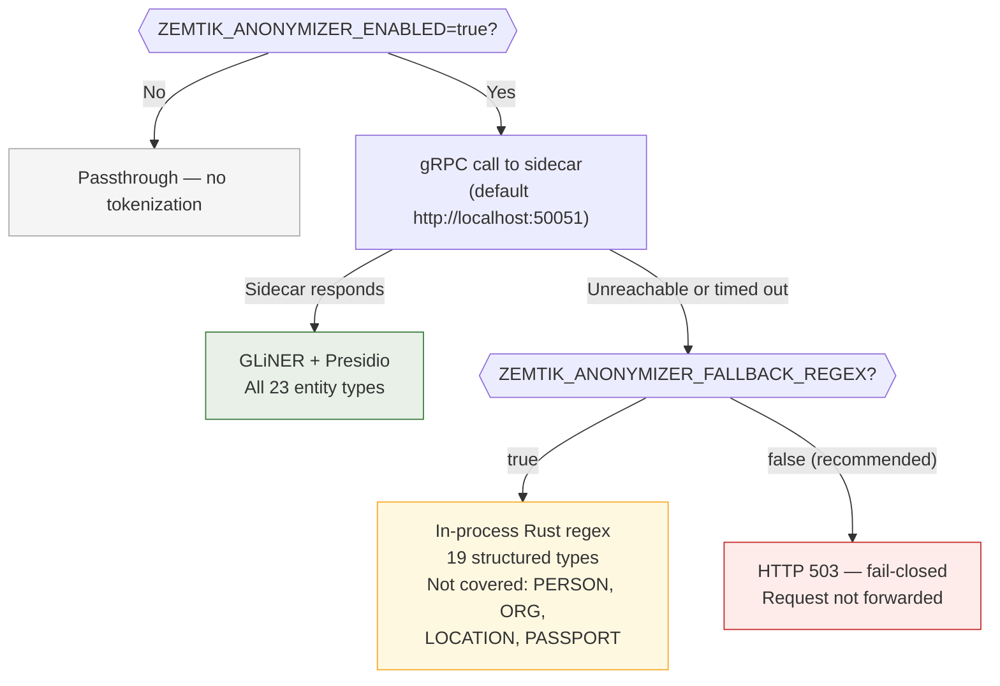

# Architecture & Stable API

## Stable API Surface

The following items are stable across patch and minor releases of `zemtik-core`.
They are re-exported from the crate root and documented via `cargo doc --no-deps`.

### Entry points

| Symbol | Signature | Notes |
|--------|-----------|-------|
| `build_proxy_router` | `async fn(AppConfig) -> Result<axum::Router, ZemtikError>` | Build Axum router; use in tests to avoid binding a real port |
| `run_proxy` | `async fn(AppConfig) -> Result<(), ZemtikError>` | Bind + serve; one-shot proxy startup |

### Configuration

| Symbol | Kind | Notes |
|--------|------|-------|
| `AppConfig` | `struct` (`#[non_exhaustive]`) | Full resolved config; construct via `load_from_sources` or `AppConfig::default()` |
| `ZemtikMode` | `enum` | `Standard` \| `Tunnel` |
| `SchemaConfig` | `struct` | Loaded from `schema_config.json` |
| `TableConfig` | `struct` | Per-table sensitivity + routing config |
| `AggFn` | `enum` | `Sum` \| `Count` \| `Avg` |
| `load_from_sources` | `fn` | Build `AppConfig` from YAML + env + CLI args |

### Types

| Symbol | Kind | Notes |
|--------|------|-------|
| `ZemtikError` | `struct` | Opaque error wrapping internal `anyhow::Error` |
| `EvidencePack` | `struct` | Attestation/proof bundle returned per request |
| `EngineResult` | `enum` | `Ok(FastLaneResult)` \| `ZkProof { … }` |
| `FastLaneResult` | `struct` | BabyJubJub attestation output |
| `IntentResult` | `struct` | Table match + confidence score |
| `Route` | `enum` | Routing decision for a request |
| `AuditRecord` | `struct` | Proxy request audit entry |
| `Transaction` | `struct` | Seeded financial transaction row |
| `TunnelAuditRecord` | `struct` | Tunnel mode comparison audit entry |
| `McpAuditRecord` | `struct` | MCP attestation audit entry |

## Semver Policy

- **Patch** (`0.x.y → 0.x.z`): bug fixes only, no API changes.
- **Minor** (`0.x → 0.x+1`): additive changes to the stable surface. New fields on
  `#[non_exhaustive]` structs, new enum variants on non-exhaustive enums, new
  re-exports. Existing stable items unchanged.
- **Major** (`0.x → 1.0`): breaking changes to the stable surface. Will include
  migration notes.

Items marked `#[doc(hidden)]` are **internal** and may change without notice in any
release. Do not depend on them from external crates.

## Transitive Stable Dependencies

`build_proxy_router` returns `axum::Router`, making `axum` an effective part of the
semver contract. The crate targets `axum 0.7.x`. If axum introduces breaking changes
we will bump our minor version and document the required axum version in the changelog.

## Security Boundaries

| Boundary | Enforcement |
|----------|-------------|
| Inbound SQL identifiers | `is_safe_identifier()` — `[a-zA-Z_][a-zA-Z0-9_]*`, max 63 chars |
| Outbound SSRF (MCP fetch) | `ssrf_block_reason()` (sync) + `ssrf_dns_guard()` (async DNS pin) |
| MCP audit endpoints | Bearer key (`ZEMTIK_MCP_API_KEY`), hard startup error if unset in `mcp-serve` mode |
| Tunnel audit endpoints | Bearer key (`ZEMTIK_DASHBOARD_API_KEY`) |
| Anthropic provider | `ZEMTIK_PROXY_API_KEY` required; gates all inbound requests |
| ZK proof verification | `bb verify` with configurable timeout (`ZEMTIK_VERIFY_TIMEOUT_SECS`) |
| PII anonymization | Sidecar gRPC + regex fallback; vault TTL eviction |

## PII Anonymizer

The anonymizer is an optional pipeline stage that pseudonymizes user input before forwarding it to the AI model, then restores original values in the model's response. It is disabled by default (`ZEMTIK_ANONYMIZER_ENABLED=false`).

### Token format

Every detected entity is replaced with a structured token:

```
[[Z:{type_hash}:{counter}]]
```

- `type_hash` — 4-hex code = `hex(SHA-256(entity_type)[0..2])`. Hardcoded in `src/entity_hashes.rs` (23 types). The Python sidecar uses `sidecar/entity_hashes.py` and `sidecar/zemtik_entity_hashes.py` — all three must agree.
- `counter` — per-session monotonic integer starting at 1. The same entity within one request always gets the same counter so the model sees consistent references.

### Detection backends



**Production recommendation:** `ZEMTIK_ANONYMIZER_FALLBACK_REGEX=false`. A sidecar outage should be a visible failure, not a silent downgrade to partial detection.

### Default entity set

21 types by default (from `src/config/env.rs`). `PHONE_NUMBER` and `EMAIL_ADDRESS` are supported (entries in `entity_hashes.rs`) but excluded from the default. Override with `ZEMTIK_ANONYMIZER_ENTITY_TYPES`.

### Vault lifecycle

A fresh in-memory vault is created per request. `scopeguard::defer!` clears it immediately after the response is returned. A background goroutine evicts any vault older than `ZEMTIK_ANONYMIZER_VAULT_TTL_SECS` (default 300s). The vault is never written to disk.

**v1 limitations:** Tokens do not persist across turns. MCP tool-result de-tokenization is not implemented. Both are planned for Phase 2.

### What pseudonymization is not

Zemtik performs **pseudonymization**, not legal anonymization. The vault holds the mapping between original values and tokens. Anyone with access to the process memory can reverse the substitution. Pseudonymized data remains personal data under GDPR Recital 26, LGPD, and equivalent laws. See `docs/FOR_LEGAL.md` and `docs/COMPLIANCE_LATAM.md`.

---

## Module Tree

```text
src/
├── lib.rs              # Stable public API surface + #[doc(hidden)] internal modules
├── error.rs            # ZemtikError — typed boundary over anyhow
├── config/
│   ├── mod.rs          # Re-exports + expand_tilde helper
│   ├── schema.rs       # SchemaConfig, TableConfig, AggFn, load/validate
│   └── env.rs          # AppConfig (#[non_exhaustive]), ZemtikMode, load_from_sources
├── types.rs            # Shared types: EvidencePack, EngineResult, FastLaneResult, …
├── proxy/
│   ├── mod.rs          # build_proxy_router, run_proxy, handle_chat_completions
│   ├── state.rs        # ProxyState, ZkPipelineResult
│   ├── lanes/
│   │   ├── mod.rs      # zemtik_evidence_envelope (shared helper)
│   │   ├── fast.rs     # FastLane engine
│   │   ├── zk.rs       # ZK SlowLane + AVG composite
│   │   └── general.rs  # General Passthrough lane
│   ├── handlers/
│   │   └── mod.rs      # Meta handlers: verify, health, models, receipts, …
│   └── ui/
│       └── mod.rs      # HTML rendering helpers
└── … (internal modules — not stable)
```
