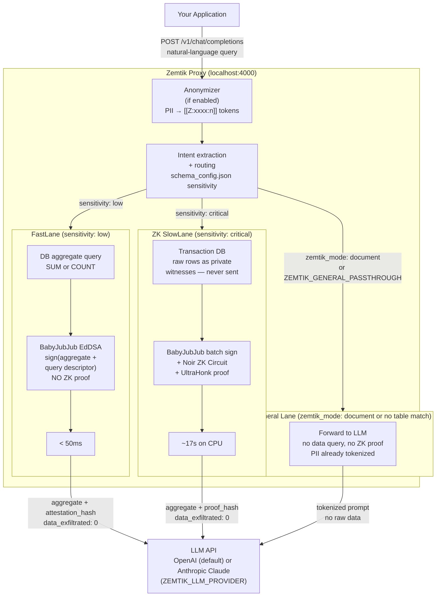

# Zemtik

> A Rust proxy that keeps sensitive data out of LLM API calls — two ways: (1) for structured database queries, it computes an aggregate locally and sends only the proven number; (2) for documents and conversations, it tokenizes PII before the prompt leaves the host. Neither raw rows nor raw personal identifiers ever reach the model.

Every enterprise that queries an LLM with internal data creates a **shadow copy** of proprietary records on third-party infrastructure. For financial institutions, healthcare providers, and legal teams, this is a legal problem. Raw transaction rows cannot leave a regulated perimeter. Patient names, tax IDs, and contract parties cannot appear in a cloud LLM's context window.

Zemtik intercepts every request at the proxy layer and enforces two complementary controls:

**For structured data queries** — Intent is extracted from the natural-language prompt, the matching table is queried locally for an aggregate (`SUM`, `COUNT`, or `AVG`), and only that number reaches the model. On the ZK SlowLane, a Noir + UltraHonk proof cryptographically binds the aggregate to the source rows. On the FastLane, a key-bound BabyJubJub signature receipt is produced. Raw rows never leave the Zemtik process on either path.

**For documents and conversations** — The GLiNER/Presidio sidecar detects PII (names, tax IDs, dates, organizations, financial identifiers) and replaces each entity with a typed `[[Z:xxxx:n]]` token before the prompt is forwarded. The model reasons over tokens, not raw identifiers. This covers contract review, legal analysis, HR document summarization, and multi-turn chat.

See [Two Lanes](#two-lanes-fastlane-vs-zk-slowlane), [PII-Safe Document Processing](#pii-anonymization), and [v1 Capability Boundary](#v1-capability-boundary) before evaluating for production.

---

## Quick Start (Docker)

No Rust toolchain or ZK tools required.

**OpenAI (default):**

```bash
export OPENAI_API_KEY=sk-...
docker compose up --build
curl http://localhost:4000/health

curl -X POST http://localhost:4000/v1/chat/completions \
  -H "Content-Type: application/json" \
  -H "Authorization: Bearer $OPENAI_API_KEY" \
  -d '{"model":"gpt-5.4-nano","messages":[{"role":"user","content":"What was our total AWS spend for Q1 2024?"}]}'
```

> **Demo circuit cap:** the example query matches 500 demo transactions — the hard circuit limit. Queries matching > 500 rows will error. See [Known Limitations](#known-limitations-poc) and [docs/SCALING.md](docs/SCALING.md).

The response includes an `evidence` block with `data_exfiltrated: 0` and an `attestation_hash` or `proof_hash`. On FastLane (the default for `aws_spend`), this is a key-bound signature receipt with no ZK constraint. Use `"sensitivity": "critical"` in `schema_config.json` for ZK proof generation. See [docs/COMPLIANCE_RECEIPT.md](docs/COMPLIANCE_RECEIPT.md).

**Anthropic Claude (v0.16.0+):**

```bash
export ZEMTIK_ANTHROPIC_API_KEY=sk-ant-...
export ZEMTIK_PROXY_API_KEY=your-strong-random-secret
ZEMTIK_LLM_PROVIDER=anthropic docker compose up --build
```

**Build variants:**

| Image | Command | Size | Notes |
|---|---|---|---|
| Default (regex intent) | `docker compose up --build` | ~150 MB | No model download |
| Semantic intent (BGE-small-en) | `docker build --build-arg BUILD_FEATURES=embed --build-arg BUILDER_IMAGE=ubuntu:24.04 --build-arg RUNTIME_IMAGE=ubuntu:24.04 -t zemtik:embed .` | ~450 MB + 130 MB first-start download | Requires glibc 2.38+ (ubuntu:24.04) |
| ZK SlowLane | `docker build --build-arg INSTALL_ZK_TOOLS=true -t zemtik:zk .` | +300 MB | Adds nargo + bb |
| Anonymizer (GLiNER sidecar) | `DOCKER_BUILDKIT=1 docker compose --profile anonymizer build && ZEMTIK_ANONYMIZER_ENABLED=true docker compose --profile anonymizer up` | ~900 MB sidecar | GLiNER + spaCy baked in; CPU inference ~2–4s; set `HF_TOKEN` for authenticated model CDN |
| MCP attestation server | `export ZEMTIK_MCP_API_KEY=<secret> && docker compose --profile mcp up` | no extra image | Reuses proxy image; exposes port 4001; `ZEMTIK_MCP_API_KEY` required |
| Everything | `DOCKER_BUILDKIT=1 docker compose --profile anonymizer build && export ZEMTIK_MCP_API_KEY=<secret> && ZEMTIK_ANONYMIZER_ENABLED=true docker compose --profile anonymizer --profile mcp up` | ~150 MB proxy + ~900 MB sidecar | Proxy (4000) + GLiNER sidecar + MCP server (4001) |

> **POC status (v0.16.1):** working proof-of-concept, not a production product. ZK circuit capped at 500 transactions; FastLane supports SQLite (default) and Supabase; signing key is file-based. See [Known Limitations](#known-limitations-poc).

---

## How It Works



### Five lanes

| Lane | Trigger | Privacy mechanism | Latency |
|---|---|---|---|
| **ZK SlowLane** | `"sensitivity": "critical"` in `schema_config.json` | Noir + UltraHonk proof; raw rows as private witnesses | ~17–20s |
| **FastLane** | `"sensitivity": "low"` | Key-bound BabyJubJub signature receipt; no ZK constraint | < 50ms |
| **General Passthrough** | No table match + `ZEMTIK_GENERAL_PASSTHROUGH=1` | Anonymizer only; no data query | LLM latency |
| **Document Mode** | `"zemtik_mode": "document"` in request | Anonymizer only; skips intent routing | LLM latency |
| **Tunnel Mode** | `ZEMTIK_MODE=tunnel` | **None — measurement only.** FORK 1 forwards request unmodified; FORK 2 runs ZK verification in background | Zero added latency |

On ZK and FastLane paths, raw transaction rows never leave the Zemtik process. **Tunnel Mode is a measurement mode, not a privacy enforcement mode** — use Standard Mode to enforce the perimeter.

---

## Two Lanes: FastLane vs ZK SlowLane

| | FastLane | ZK SlowLane |
|---|---|---|
| Raw rows sent to LLM | Never | Never |
| Aggregate is sensitive | No — if yes, use ZK | Yes |
| Cryptographic proof of correct computation | No | Yes — UltraHonk |
| AVG supported | No | Yes (composite: SUM + COUNT proofs + BabyJubJub attestation for division) |
| Latency | < 50ms | ~17–20s |
| Config (`schema_config.json`) | `"sensitivity": "low"` | `"sensitivity": "critical"` |

Unknown tables not in `schema_config.json` always route to ZK SlowLane (fail-secure).

> **FastLane warning:** no circuit constraint prevents a malicious operator from signing an arbitrary aggregate. Use FastLane only for non-sensitive aggregates where an honest-prover model is acceptable.

See [docs/ZK_CIRCUITS.md](docs/ZK_CIRCUITS.md) for circuit internals, trust model, and offline verification.

---

## PII Anonymization

The GLiNER/Presidio sidecar detects named entities and replaces them with typed tokens before any lane runs:

```
"Can José García help with our payroll?"
→ "Can [[Z:a1b2:0]] help with our payroll?"
```

The `[[Z:xxxx:n]]` format encodes the entity type (4-char CRC hash) and a per-session counter. A session vault maps each token to its original value.

**Quick start:**

```bash
docker build -f sidecar/Dockerfile -t zemtik-sidecar .
docker run -p 50051:50051 zemtik-sidecar

export ZEMTIK_ANONYMIZER_ENABLED=true
export ZEMTIK_ANONYMIZER_SIDECAR_ADDR=http://localhost:50051
cargo run -- proxy
```

Use `"zemtik_mode": "document"` in any request to skip intent routing and send straight to the general lane — the anonymizer still runs. Suitable for contract review, legal analysis, HR summarization.

**Detection quality:** tokenization accuracy depends on GLiNER entity boundary precision. Compound organizational names, abbreviated identifiers, and code-switched text may be partially tokenized. Verify output via `POST /v1/anonymize/preview` before relying on this in regulated environments. The regex fallback (`ZEMTIK_ANONYMIZER_FALLBACK_REGEX`) covers obvious patterns only.

See [sidecar/README.md](sidecar/README.md) for sidecar setup and [docs/CONFIGURATION.md](docs/CONFIGURATION.md) for all anonymizer env vars (15-type default entity set; 22 types total — `PHONE_NUMBER`, `EMAIL_ADDRESS`, `EC_RUC`, `PE_RUC`, `BO_NIT`, `UY_CI`, `VE_CI` excluded from default).

---

## MCP + Claude Desktop (v0.16.0+)

Zemtik ships an MCP server that routes document text through the anonymizer before Claude reasons on it. The `zemtik_analyze` tool replaces PII with `[[Z:xxxx:n]]` tokens; every tool call is attested with a BabyJubJub EdDSA signature.

Note: Claude calling `zemtik_analyze` is enforced by the system prompt, not by the proxy. Tokenization quality depends on GLiNER entity boundary detection.

```bash
export ZEMTIK_MCP_API_KEY=$(openssl rand -hex 32)
ZEMTIK_ANONYMIZER_ENABLED=true docker compose --profile anonymizer --profile mcp up -d
```

| Command | Transport | Use case |
|---|---|---|
| `zemtik mcp` | stdio | Claude Desktop (local binary) |
| `zemtik mcp-serve` | Streamable HTTP on `:4001` | Docker, IDE plugins, CI |

See [docs/MCP_ATTESTATION.md](docs/MCP_ATTESTATION.md) for full setup, audit record schema, and governed mode.

---

## Where Zemtik Applies

| Industry | What stays private | Lane |
|---|---|---|
| **Healthcare** | Patient identifiers, individual claim amounts | ZK SlowLane |
| **Legal** | Matter IDs, attorney-client assignments | ZK SlowLane + anonymizer |
| **Insurance** | Policy holder IDs, individual payouts | ZK SlowLane |
| **E-commerce** | Customer IDs, purchase history | FastLane |
| **Government / Defense** | Contractor identities, program funding | ZK SlowLane |
| **Pharma / Biotech** | Trial IDs, per-compound pipeline spend | ZK SlowLane |
| **Fintech / Crypto** | Wallet addresses, transaction counterparties | ZK SlowLane |

> **Regulatory citations** indicate where Zemtik's controls are relevant — not that Zemtik constitutes HIPAA, GDPR, FedRAMP, or other compliance. Consult legal counsel to assess applicability.
>
> **Document review / RAG workloads** (contract analysis, legal drafting, HR summarization) do not route to ZK or FastLane. Only the anonymizer pipeline applies.

See [docs/INDUSTRY_USE_CASES.md](docs/INDUSTRY_USE_CASES.md) for SQL schemas, `schema_config.json` examples, and column mapping per industry.

---

## v1 Capability Boundary

| Capability | v1 status |
|---|---|
| Connect to arbitrary Postgres directly | Not supported — requires Supabase/PostgREST |
| ZK-prove queries with > 500 matching rows | Not supported — circuit fixed at 500 rows (10 × 50) |
| AVG, multi-table JOINs, GROUP BY | AVG via ZK composite proof. JOINs and GROUP BY not supported. |
| Sub-second ZK proofs | Not supported — ~17s on CPU |
| Eliminate need to trust the Zemtik process | Not possible — binary reads signing key and constructs witnesses |

---

## Measured Performance

Numbers from `audit/2026-03-25T17-46-43Z.json`:

| Metric | Value |
|---|---|
| Transactions processed | 500 (10 × 50) — hard circuit limit |
| Circuit execution | 2.4s |
| Full pipeline (DB → proof → AI response) | ~20s |
| Proof scheme | UltraHonk (Barretenberg v4) |
| Proof status | `nargo execute`: **VALID** — all constraints satisfied. `bb prove`: blocked upstream (`eddsa v0.1.3` × Barretenberg v4; tracked). |
| Raw rows sent to LLM | **0** |

---

## Technology Stack

| Component | Technology | Version |
|---|---|---|
| ZK circuit | Noir | 1.0.0-beta.19 |
| Proof backend | Barretenberg (UltraHonk) | v4.0.0-nightly |
| Signature scheme | BabyJubJub EdDSA + Poseidon | BN254 |
| Proxy / orchestrator | Rust + Axum | 1.70+ / 0.8 |
| Database | SQLite (in-memory) or Supabase (PostgREST) | — |
| LLM inference (default) | OpenAI `gpt-5.4-nano` | Chat Completions API |
| LLM inference (optional) | Anthropic Claude `claude-sonnet-4-6` | Messages API (v0.16.0+) |

---

## Known Limitations (POC)

- **Hard 500-row circuit limit** — queries matching > 500 rows error. See [docs/SCALING.md](docs/SCALING.md).
- **No raw Postgres connector** — supports `sqlite` (demo) and `supabase` (PostgREST). Native `sqlx` connector planned for v2.
- **File-based signing key** — `~/.zemtik/keys/bank_sk`. A compromised file produces validly-signed but fraudulent proofs. Production requires HSM/KMS.
- **`bb prove` blocked** — `eddsa v0.1.3` × Barretenberg v4+ incompatibility. `nargo execute` validates all constraints. Unblocked when upstream library updates.
- **Aggregation support** — FastLane: `SUM`, `COUNT`. ZK SlowLane: `SUM`, `COUNT`, `AVG` (composite). No JOINs or GROUP BY.
- **CLI pipeline hardcoded** — 500 txs, client 123, `aws_spend`, Q1 2024. Proxy mode supports arbitrary tables via `schema_config.json`.
- **Local CPU proving** — ~17s per query. Sub-second latency requires GPU/FPGA on-prem. See [docs/SCALING.md](docs/SCALING.md).
- **Public-input sidecar not committed** — category, time range, and table name are not cryptographically committed by the ZK circuit (tracked).
- **Anonymizer: partial entity detection** — compound ORG names and abbreviated identifiers may be partially tokenized. Verify via `/v1/anonymize/preview`.

---

## Zemtik Enterprise

This repository is the MIT-licensed core layer. The commercial product adds:

| Feature | Description |
|---|---|
| **Map-Reduce ZK aggregator** | Horizontal proof generation — scales from 500 to 500,000+ transactions |
| **CISO dashboard** | Real-time visibility: what was queried, what was transmitted, SOC2-ready audit exports |
| **SSO / RBAC** | Active Directory, Okta, SAML; per-team query authorization policies |
| **LLM fallback routing** | Automatic failover across model providers |
| **On-prem GPU proving** | Sub-second latency at enterprise scale |

**Contact:** [david@zemtik.com](mailto:david@zemtik.com)

---

## Docs

- [Getting Started](docs/GETTING_STARTED.md) — end-to-end setup: Docker, build-from-source, Anthropic backend, MCP
- [Configuration](docs/CONFIGURATION.md) — all env vars, `schema_config.json` format, general passthrough, query rewriter
- [Architecture](docs/ARCHITECTURE.md) — component breakdown, data flow, cryptographic properties
- [ZK Circuits](docs/ZK_CIRCUITS.md) — Poseidon Merkle tree, mini-circuit layout, public input schema, offline verification, threat model
- [Compliance Receipt](docs/COMPLIANCE_RECEIPT.md) — `evidence` response fields for auditors
- [Evidence Pack Auditor Guide](docs/EVIDENCE_PACK_AUDITOR_GUIDE.md) — field-by-field guide, independent ZK verification steps, SOC 2 mapping
- [How to Add a Table](docs/HOW_TO_ADD_TABLE.md) — step-by-step `schema_config.json` entry
- [Supported Queries](docs/SUPPORTED_QUERIES.md) — v1 query contract, time expressions, error reference
- [Intent Engine](docs/INTENT_ENGINE.md) — EmbeddingBackend, DeterministicTimeParser, confidence thresholds
- [Tunnel Mode](docs/TUNNEL_MODE.md) — full config, audit record schema, dashboard endpoints, match status variants
- [MCP Attestation](docs/MCP_ATTESTATION.md) — `zemtik_analyze`, Claude Desktop setup, governed mode, audit schema
- [Industry Use Cases](docs/INDUSTRY_USE_CASES.md) — SQL schemas and `schema_config.json` examples per vertical
- [Scaling](docs/SCALING.md) — recursive proofs, GPU/FPGA path, why remote proving breaks the privacy guarantee
- [Anonymizer Sidecar](sidecar/README.md) — GLiNER + Presidio gRPC sidecar, entity types, byte-offset invariant

---

## Using zemtik-core as a Library

Add to `Cargo.toml`:

```toml
[dependencies]
zemtik = { git = "https://github.com/dacarva/zemtik-core", tag = "v0.16.0" }
axum = "0.7"
tokio = { version = "1", features = ["full"] }
```

Minimal proxy startup:

```rust
use zemtik::{AppConfig, build_proxy_router, ZemtikError};

type BoxError = Box<dyn std::error::Error + Send + Sync + 'static>;

#[tokio::main]
async fn main() -> Result<(), BoxError> {
    // Load config from ~/.zemtik/config.yaml + env vars
    let config = AppConfig::load(&Default::default())?;

    let router = build_proxy_router(config.clone()).await?;
    let listener = tokio::net::TcpListener::bind(&config.bind_addr).await?;
    axum::serve(listener, router).await?;
    Ok(())
}
```

Or use the one-shot helper that binds and serves:

```rust
use zemtik::{AppConfig, run_proxy, ZemtikError};

#[tokio::main]
async fn main() -> Result<(), ZemtikError> {
    let config = AppConfig::load(&Default::default())
        .map_err(ZemtikError::from)?;
    run_proxy(config).await
}
```

**Stable surface** — `AppConfig`, `ZemtikMode`, `SchemaConfig`, `TableConfig`, `AggFn`,
`load_from_sources`, `build_proxy_router`, `run_proxy`, `ZemtikError`, and the types in
`zemtik::types` (`EvidencePack`, `EngineResult`, `FastLaneResult`, …) are stable across
patch and minor releases. All other items are `#[doc(hidden)]` internal modules.

See [ARCHITECTURE.md](ARCHITECTURE.md) for the full stable API reference and semver policy.

---

## License

[MIT](LICENSE) — Copyright (c) 2026 Zemtik Contributors
