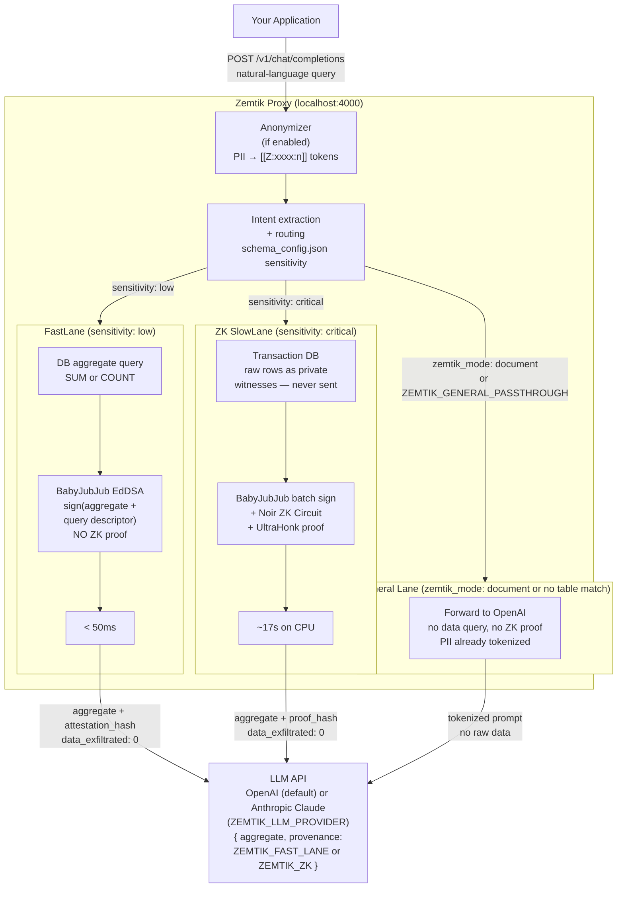
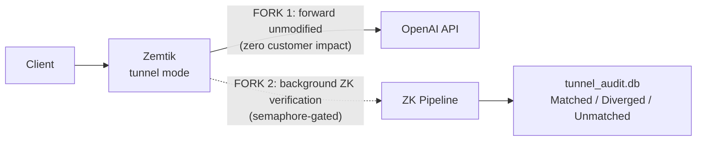

# Zemtik

> A Rust proxy that intercepts LLM prompts, queries your local database, computes an aggregate inside a Zero-Knowledge circuit, and sends only the proven number to the model. Zero raw rows leave the perimeter.

Every time a company queries an LLM with internal data, it creates a **shadow copy** of proprietary records on third-party infrastructure. For financial institutions, healthcare providers, and defense contractors, this isn't a policy problem—it's a legal one. Raw transaction rows, patient records, or classified queries cannot leave the enterprise perimeter.

Zemtik solves this at the infrastructure layer: **compute the answer locally inside a Zero-Knowledge circuit, prove the computation was honest, and send only the proven number to the model.** Zero raw rows ever leave the perimeter.

---

## Quick Start (Docker)

The fastest way to run Zemtik. No Rust toolchain or ZK tools required.

**OpenAI (default):**

```bash
# 1. Set your OpenAI API key
export OPENAI_API_KEY=sk-...

# 2. Start the proxy (binds to localhost:4000)
docker compose up --build

# 3. Verify it's running
curl http://localhost:4000/health

# 4. Send a query — the magic moment: data_exfiltrated is always 0
curl -X POST http://localhost:4000/v1/chat/completions \
  -H "Content-Type: application/json" \
  -H "Authorization: Bearer $OPENAI_API_KEY" \
  -d '{
    "model": "gpt-5.4-nano",
    "messages": [{"role": "user", "content": "What was our total AWS spend for Q1 2024?"}]
  }'
```

**Anthropic Claude (v0.16.0+):**

```bash
# No OpenAI key needed — Zemtik uses your Anthropic key server-side
export ZEMTIK_ANTHROPIC_API_KEY=sk-ant-...
export ZEMTIK_PROXY_API_KEY=your-strong-random-secret   # clients send this as Bearer
ZEMTIK_LLM_PROVIDER=anthropic docker compose up --build

curl -X POST http://localhost:4000/v1/chat/completions \
  -H "Content-Type: application/json" \
  -H "Authorization: Bearer $ZEMTIK_PROXY_API_KEY" \
  -d '{
    "model": "gpt-5.4-nano",
    "messages": [{"role": "user", "content": "What was our total AWS spend for Q1 2024?"}]
  }'
```

The response includes an `evidence` block with `data_exfiltrated: 0` and `attestation_hash` — a cryptographic receipt you can show to auditors. See [docs/COMPLIANCE_RECEIPT.md](docs/COMPLIANCE_RECEIPT.md) for field descriptions.

The `docker-compose.yml` already mounts `schema_config.example.json` (aws\_spend, payroll, travel, and more). To use your own data, replace that mount with your own `schema_config.json`.

**Build variants** — the default image uses regex-based intent matching (~150MB). Two optional upgrades:

```bash
# Semantic intent matching (BGE-small-en ONNX, ~450MB image; model downloads ~130MB on first start)
docker build --build-arg BUILD_FEATURES=embed \
             --build-arg BUILDER_IMAGE=ubuntu:24.04 \
             --build-arg RUNTIME_IMAGE=ubuntu:24.04 \
             -t zemtik:embed .

# ZK SlowLane support — adds nargo + bb (~+300MB; requires INSTALL_ZK_TOOLS=true)
docker build --build-arg INSTALL_ZK_TOOLS=true -t zemtik:zk .

# Both combined
docker build --build-arg BUILD_FEATURES=embed \
             --build-arg BUILDER_IMAGE=ubuntu:24.04 \
             --build-arg RUNTIME_IMAGE=ubuntu:24.04 \
             --build-arg INSTALL_ZK_TOOLS=true \
             -t zemtik:embed-zk .
```

The ubuntu:24.04 base is required for embed because the ONNX Runtime C++ layer needs glibc 2.38+ (Debian Bookworm ships 2.36).

> **POC status (v0.16.0):** This is a working proof-of-concept, not a production product. Current hard limits: ZK circuit is fixed at 500 transactions per query; FastLane supports `DB_BACKEND=sqlite` (default, in-memory) and `DB_BACKEND=supabase` (Supabase integration enabled only when explicitly set — raw Postgres connector planned for v2); the signing key is file-based at `~/.zemtik/keys/bank_sk` (HSM integration planned for v2). See [Known Limitations](#known-limitations-poc) before evaluating for production use.

---

## How It Works

Zemtik runs as a local proxy on `localhost:4000`. Point your application at it instead of `api.openai.com` — the HTTP interface is OpenAI-compatible, so no client-side code changes are required. Server-side setup requires a conforming database schema and `schema_config.json` (see [Getting Started](docs/GETTING_STARTED.md)).



In all paths, raw transaction rows **never leave the Zemtik process**. The anonymizer (if enabled) tokenizes PII before any path runs. Which data path executes is determined by the `sensitivity` field in `schema_config.json` or by the `zemtik_mode` field in the request. See [Two Lanes: FastLane vs ZK SlowLane](#two-lanes-fastlane-vs-zk-slowlane) and [PII-Safe Document Processing](#pii-safe-document-processing-v0154) below.

> **KMS note:** `~/.zemtik/keys/bank_sk` is a 32-byte file (mode 0600) that acts as the BabyJubJub signing key. The ZK circuit's soundness guarantee — `assert(eddsa_verify(...))` — holds only if this key is genuinely controlled by the institution. A compromised file means a compromised attestation. Production deployments must replace this with an HSM or KMS (v2 roadmap).

---

## Two Lanes: FastLane vs ZK SlowLane

Zemtik routes each query to one of two execution paths based on the `"sensitivity"` field you configure per table in `schema_config.json`.

### FastLane (`"sensitivity": "low"`)

FastLane is designed for aggregates that are not themselves sensitive — for example, total e-commerce revenue by category, public-facing headcount by department, or any metric where the aggregate number is safe to share.

1. Zemtik queries the database for the aggregate (`SUM` or `COUNT`) directly. **No raw rows are fetched.**
2. BabyJubJub EdDSA signs the result together with a query descriptor (table, columns, time range, aggregation function).
3. The `attestation_hash` and aggregate are forwarded to OpenAI.

**Latency:** < 50ms.

> **Warning — FastLane does not generate a Zero-Knowledge proof.** There is no circuit constraint preventing a malicious operator from signing an arbitrary aggregate value. The privacy guarantee is that raw rows never leave the Zemtik process; the correctness guarantee relies on trusting the Zemtik binary and the confidentiality of `~/.zemtik/keys/bank_sk`. Use FastLane only for tables where the aggregate is non-sensitive and an honest-prover model is acceptable.

### ZK SlowLane (`"sensitivity": "critical"`)

ZK SlowLane is required for tables where even an aggregate could reveal sensitive information — payroll totals, patient counts, classified procurement figures, or anything subject to data-residency regulation.

1. Raw rows are fetched as **private witnesses** — they stay inside the Rust process and are never written to disk or sent over the network.
2. Each batch of 50 rows is signed with BabyJubJub EdDSA over a Poseidon commitment tree.
3. A Noir ZK circuit verifies every signature and computes the aggregate. The circuit is a mathematical constraint: a dishonest prover cannot produce a valid proof for a wrong aggregate without breaking the signature assumption.
4. Barretenberg generates an UltraHonk proof. The `proof_hash` is included in the response and can be independently verified offline.

**Latency:** ~17–20s on CPU. See [docs/SCALING.md](docs/SCALING.md) for the GPU/FPGA path.

### Choosing the right lane

| | FastLane | ZK SlowLane |
|---|---|---|
| Raw rows sent to OpenAI | Never | Never |
| Aggregate is sensitive | No — if yes, use ZK | Yes |
| Cryptographic proof of correct computation | No | Yes — UltraHonk |
| AVG supported | No | Yes (composite: SUM + COUNT proofs) |
| Latency | < 50ms | ~17–20s |
| Config (`schema_config.json`) | `"sensitivity": "low"` | `"sensitivity": "critical"` |

Unknown tables that are not in `schema_config.json` always route to ZK SlowLane (fail-secure).

---

## General Passthrough Lane (v0.11.0+)

Real conversations mix structured data queries ("What was Q1 spend?") and general follow-up questions ("Can you explain that?"). Without General Passthrough, non-data queries that fail intent extraction return HTTP 400 `NoTableIdentified`.

Enable `ZEMTIK_GENERAL_PASSTHROUGH=1` to route those queries to OpenAI directly. Zemtik logs a receipt and injects a `zemtik_meta` block into the response so you always know which lane handled the request.

```bash
export ZEMTIK_GENERAL_PASSTHROUGH=1
export ZEMTIK_GENERAL_MAX_RPM=60   # optional: max general-lane requests/minute (0 = unlimited)
cargo run -- proxy
```

```bash
# Data query — ZK/FastLane as normal
curl -X POST http://localhost:4000/v1/chat/completions \
  -H "Content-Type: application/json" -H "Authorization: Bearer $OPENAI_API_KEY" \
  -d '{"model":"gpt-5.4-nano","messages":[{"role":"user","content":"Q1 2024 aws_spend total"}]}'

# General follow-up — now succeeds instead of returning 400
curl -X POST http://localhost:4000/v1/chat/completions \
  -H "Content-Type: application/json" -H "Authorization: Bearer $OPENAI_API_KEY" \
  -d '{"model":"gpt-5.4-nano","messages":[{"role":"user","content":"Can you summarize that for a non-technical audience?"}]}'
```

General lane responses include:
```json
{
  "zemtik_meta": {
    "engine_used": "general_lane",
    "zk_coverage": "none",
    "reason": "no_table_match",
    "receipt_id": "<uuid>"
  }
}
```

`zk_coverage: "none"` confirms no ZK verification was applied — and none was needed, since no raw data was queried. The `/health` endpoint exposes `general_queries_today` and `intent_failures_today` counters. Rate-limit breaches return HTTP 429 with error code `GeneralLaneBudgetExceeded`.

See [docs/CONFIGURATION.md](docs/CONFIGURATION.md#general-passthrough-v0110) for full configuration reference and streaming notes.

---

## Multi-Provider LLM Backend (v0.16.0+)

Zemtik v0.16.0 introduces a `LlmBackend` trait that decouples the proxy from any single LLM provider. Two backends ship out of the box:

| Backend | `ZEMTIK_LLM_PROVIDER` | Auth model | Use case |
|---|---|---|---|
| `OpenAiBackend` | `openai` (default) | BYOK — client Bearer forwarded to OpenAI | Existing deployments, no change required |
| `AnthropicBackend` | `anthropic` | Operator-key — `ZEMTIK_ANTHROPIC_API_KEY` used server-side; client sends `ZEMTIK_PROXY_API_KEY` | Regulated industries requiring Claude; no API key exposure to clients |

All three lanes (ZK SlowLane, FastLane, GeneralLane) route through whichever backend is configured. The client request format is identical in both cases — OpenAI-compatible `POST /v1/chat/completions`.

### Switching to Anthropic

```bash
# .env additions
ZEMTIK_LLM_PROVIDER=anthropic
ZEMTIK_ANTHROPIC_API_KEY=sk-ant-...
ZEMTIK_ANTHROPIC_MODEL=claude-sonnet-4-6      # default; override as needed
ZEMTIK_PROXY_API_KEY=your-strong-random-secret
```

Start:

```bash
cargo run -- proxy
# or: ZEMTIK_LLM_PROVIDER=anthropic docker compose up --build
```

Send a request — the proxy accepts any model name and substitutes `ZEMTIK_ANTHROPIC_MODEL`:

```bash
curl -X POST http://localhost:4000/v1/chat/completions \
  -H "Content-Type: application/json" \
  -H "Authorization: Bearer $ZEMTIK_PROXY_API_KEY" \
  -d '{"model":"claude-sonnet-4-6","messages":[{"role":"user","content":"What was our total AWS spend for Q1 2024?"}]}'
```

The response `zemtik_meta` block includes `"resolved_model": "claude-sonnet-4-6"` confirming which model handled the request. The `evidence.llm_provider` field records `"anthropic"` in the receipts database (v10 migration).

### Discover configured model

```bash
# Protected by ZEMTIK_PROXY_API_KEY when set
curl -H "Authorization: Bearer $ZEMTIK_PROXY_API_KEY" http://localhost:4000/v1/models
# → {"object":"list","data":[{"id":"claude-sonnet-4-6","owned_by":"anthropic",...}]}
```

### Security: key separation

When `llm_provider=anthropic`, the client's `Authorization: Bearer` header is validated against `ZEMTIK_PROXY_API_KEY` and **never forwarded to Anthropic**. All outbound Claude calls use the server-side `ZEMTIK_ANTHROPIC_API_KEY`. Client code never sees the operator's Anthropic credentials.

`ZEMTIK_PROXY_API_KEY` is a hard startup error when `llm_provider=anthropic` — the proxy refuses to start without it.

### Known limitations (v0.16.0)

- `stream: true` with `llm_provider=anthropic` returns HTTP 501 (`AnthropicStreamingUnsupported`). Set `stream: false`. OpenAI streaming is unchanged.
- Multi-modal / vision content (content arrays with `image_url` blocks) not supported with the Anthropic backend.

See [docs/GETTING_STARTED.md](docs/GETTING_STARTED.md#switching-to-anthropic-claude) for the full quickstart and guidance on adding future providers.

---

## PII-Safe Document Processing (v0.15.4+)

The anonymizer and `zemtik_mode: document` work together as a complete document processing pipeline. Set `"zemtik_mode": "document"` in any chat/completions request to skip intent-based routing entirely and send the request straight to the general lane — bypassing the data query pipeline. The anonymizer still runs. Names, tax IDs, salaries, and other PII are tokenized before OpenAI sees the document, and the response is de-anonymized before it reaches the client.

Use this for contract review, legal analysis, HR policy summarization, or any workload where you want PII protection without data query routing overhead.

**Setup:**

```bash
# Start the sidecar (required for NER-based detection)
docker build -f sidecar/Dockerfile -t zemtik-sidecar .
docker run -p 50051:50051 zemtik-sidecar

# Start the proxy with passthrough + anonymizer enabled
export OPENAI_API_KEY=sk-...
export ZEMTIK_GENERAL_PASSTHROUGH=1
export ZEMTIK_ANONYMIZER_ENABLED=true
export ZEMTIK_ANONYMIZER_SIDECAR_ADDR=http://localhost:50051
cargo run -- proxy
```

**Request:**

```bash
curl -X POST http://localhost:4000/v1/chat/completions \
  -H "Content-Type: application/json" \
  -H "Authorization: Bearer $OPENAI_API_KEY" \
  -H "x-session-id: session-abc123" \
  -d '{
    "model": "gpt-5.4-nano",
    "zemtik_mode": "document",
    "messages": [{
      "role": "user",
      "content": "Summarize the key obligations in this contract. The contractor is Carlos García (CC 79.123.456) and the company is Inversiones Andinas S.A.S. (NIT 900.123.456-7). Salary: $12.500.000 COP/month."
    }]
  }'
```

What Zemtik sends to OpenAI:

```
Summarize the key obligations in this contract. The contractor is [[Z:a1b2:0]] (CC [[Z:c3d4:1]]) and the company is [[Z:e5f6:2]] (NIT [[Z:g7h8:3]]). Salary: [[Z:i9j0:4]] COP/month.
```

The response includes:

```json
{
  "zemtik_meta": {
    "engine_used": "general_lane",
    "zk_coverage": "none",
    "reason": "zemtik_mode_document",
    "anonymizer": {
      "entities_found": 5,
      "entity_types": ["PERSON", "CO_CEDULA", "ORG", "CO_NIT", "MONEY"],
      "sidecar_used": true,
      "sidecar_ms": 38,
      "dropped_tokens": 0
    }
  }
}
```

`zemtik_mode: "data"` forces normal routing (the default when the field is absent). The field is stripped before forwarding to OpenAI. Passing an invalid value returns HTTP 400. The field is ignored in tunnel mode.

**Document-only deployments:** use `schema_config.legal.json` (included in the repo root) — an empty `tables` map that forces all requests to the general lane while keeping the anonymizer pipeline active. Mount it as `ZEMTIK_SCHEMA_CONFIG_PATH=./schema_config.legal.json` or via Docker volume:

```bash
docker run -e ZEMTIK_GENERAL_PASSTHROUGH=1 \
           -e ZEMTIK_ANONYMIZER_ENABLED=true \
           -v ./schema_config.legal.json:/root/.zemtik/schema_config.json \
           zemtik:latest
```

---

## Tunnel Mode (Pilot Evaluation)

Tunnel Mode is designed for customers who want to evaluate Zemtik without any risk to their production traffic. Set `ZEMTIK_MODE=tunnel` and Zemtik becomes a **transparent passthrough proxy** — every request is forwarded to OpenAI exactly as received (FORK 1) while Zemtik runs its verification pipeline in the background (FORK 2) and logs a comparison audit record.



The customer sees zero latency penalty and zero risk of broken requests. Zemtik learns how well its verification matches real responses before any enforcement is turned on.

**Quick start:**
```bash
export ZEMTIK_MODE=tunnel
export ZEMTIK_TUNNEL_API_KEY=sk-...
export ZEMTIK_DASHBOARD_API_KEY=secret
cargo run -- proxy

# Check match rates after sending traffic
curl -H "Authorization: Bearer secret" http://localhost:4000/tunnel/summary
```

Response headers added in tunnel mode:
- `x-zemtik-mode: tunnel` — always present
- `x-zemtik-verified: true/false` — `false` when backpressure prevented verification
- `x-zemtik-receipt-id: <uuid>` — correlates with audit database entry

See [docs/TUNNEL_MODE.md](docs/TUNNEL_MODE.md) for the full configuration reference, audit record schema, and dashboard endpoint documentation.

---

## Anonymizer (v0.14.0+)

Zemtik can tokenize PII in prompts before they leave the host. Names, organizations, and locations are replaced with typed tokens so the model never sees raw PII. The anonymizer runs on every lane — FastLane, ZK SlowLane, and general lane. This means it also protects document processing workloads: combine it with `"zemtik_mode": "document"` for PII-safe contract review, legal analysis, or HR document summarization without data query routing. See [PII-Safe Document Processing](#pii-safe-document-processing-v0154) for the full setup.

```
"Can José García help with our payroll?"
→ "Can [[Z:a1b2:0]] help with our payroll?"
```

The `[[Z:xxxx:n]]` format encodes the entity type (`xxxx` = 4-char hash of `PERSON`, `ORG`, etc.) and a per-session counter (`n`). Zemtik maintains a per-session vault mapping each token to its original value (tokenization and per-session token mapping only — multi-turn deanonymization is Phase 2–3).

**Start the sidecar first** (GLiNER NER model, ~500 MB image):

```bash
# From repo root:
docker build -f sidecar/Dockerfile -t zemtik-sidecar .
docker run -p 50051:50051 zemtik-sidecar
# Wait for: status: SERVING (model loads in ~30s first run, instant after)
```

**Enable anonymizer in the proxy:**

```bash
export ZEMTIK_ANONYMIZER_ENABLED=true
export ZEMTIK_ANONYMIZER_SIDECAR_ADDR=http://localhost:50051
cargo run -- proxy
```

Every response includes a `zemtik_meta.anonymizer` block:

```json
{
  "zemtik_meta": {
    "anonymizer": {
      "entities_found": 1,
      "entity_types": ["PERSON"],
      "sidecar_used": true,
      "sidecar_ms": 42,
      "dropped_tokens": 0
    }
  }
}
```

`dropped_tokens` counts how many vault tokens from this session are absent from the LLM's response — i.e., entities the model paraphrased or omitted rather than preserving as opaque `[[Z:xxxx:n]]` tokens. A non-zero value means the model did not fully respect the token-preservation system prompt; the vault still holds the mapping for deanonymization when that lands in Phase 2.

When `ZEMTIK_ANONYMIZER_DEBUG_PREVIEW=true` is set, the block also includes `outgoing_preview` — the first 200 characters of the anonymized prompt — to help verify tokenization in non-production environments. Disable in production.

Pass `x-session-id: <id>` in requests to keep the vault across a multi-turn conversation. The sidecar falls back to regex matching if it's unreachable (`ZEMTIK_ANONYMIZER_FALLBACK_REGEX=true` by default).

**All anonymizer env vars:**

| Variable | Default | Description |
|---|---|---|
| `ZEMTIK_ANONYMIZER_ENABLED` | `false` | Master switch. Anonymizer is a no-op when disabled. |
| `ZEMTIK_ANONYMIZER_SIDECAR_ADDR` | `http://localhost:50051` | gRPC address of the Python sidecar. (Deprecated alias: `ZEMTIK_ANONYMIZER_SIDECAR_URL`.) |
| `ZEMTIK_ANONYMIZER_SIDECAR_TIMEOUT_MS` | `1500` | gRPC call timeout in milliseconds. Increase if the sidecar is slow to respond. |
| `ZEMTIK_ANONYMIZER_FALLBACK_REGEX` | `true` | Use regex patterns when sidecar is unreachable. |
| `ZEMTIK_ANONYMIZER_ENTITY_TYPES` | `PERSON,ORG,LOCATION,CO_NIT,CO_CEDULA,AR_DNI,CL_RUT,BR_CPF,BR_CNPJ,MX_CURP,MX_RFC,ES_NIF,IBAN_CODE,DATE_TIME,MONEY` | Comma-separated entity types forwarded to the sidecar. 15-type default set; `PHONE_NUMBER` and `EMAIL_ADDRESS` are supported (17 total in `entity_hashes.rs`) but excluded from the default. |
| `ZEMTIK_ANONYMIZER_DEBUG_PREVIEW` | `false` | Emit `outgoing_preview` in `zemtik_meta.anonymizer`. Disable in production. |
| `ZEMTIK_ANONYMIZER_VAULT_TTL_SECS` | `300` | Seconds before a session vault is evicted from memory. |

**Note on intent extraction:** When the anonymizer replaces PII (e.g. `"Jose Garcia"` → `[[Z:a1b2:0]]`), intent extraction runs on the **original** prompt, not the tokenized one, to preserve embedding quality. Non-data queries that reference entities (e.g. `"who is Jose Garcia?"`) still return `NoTableIdentified` — enable `ZEMTIK_GENERAL_PASSTHROUGH=1` to route these through the general lane.

**Preview endpoint (debug only):**

```bash
# Tokenize messages without sending to OpenAI — useful for verifying entity detection
curl -X POST http://localhost:4000/v1/anonymize/preview \
  -H "Content-Type: application/json" \
  -H "Authorization: Bearer $OPENAI_API_KEY" \
  -d '{"messages": [{"role": "user", "content": "José García needs access."}]}'
```

Requires `ZEMTIK_ANONYMIZER_ENABLED=true`. Returns the tokenized messages array and audit spans without forwarding to OpenAI.

**Phase 1 scope:** tokenization only. Deanonymization of LLM responses and vault persistence are planned for Phase 2-3. See `TODOS.md` for the roadmap.

---

## MCP + Claude Desktop — Production-Grade PII Protection (v0.16.0+)

Zemtik ships an **MCP (Model Context Protocol) server** that makes Claude Desktop safe for regulated industries. In v0.16.0, Claude Desktop integration is production-grade: the new `zemtik_analyze` tool tokenizes PII before Claude ever reasons on sensitive documents, and every tool call is attested with a BabyJubJub EdDSA signature.

### What changed in v0.16.0

Previously, the MCP server provided attestation only — it logged what Claude accessed, but did not intercept or anonymize content. The `zemtik_analyze` tool closes this gap: when a user pastes a contract, HR document, or medical record into Claude Desktop, Claude calls `zemtik_analyze` first, which routes the text through the same GLiNER/Presidio sidecar as the proxy. Claude receives only `[[Z:xxxx:n]]` tokens — never the raw PII.

### Available MCP tools

| Tool | Description | Requires |
|------|-------------|---------|
| `zemtik_fetch` | HTTPS fetch with SSRF guard (blocks RFC 1918, IMDS, loopback) | Always available |
| `zemtik_read_file` | File read with key-file protection and 10 MB cap | Always available |
| `zemtik_analyze` | Tokenize PII in arbitrary text before Claude reasons on it | `ZEMTIK_ANONYMIZER_ENABLED=true` |

### Quick start (Claude Desktop + Docker)

```bash
# Generate a strong API key
export ZEMTIK_MCP_API_KEY=$(openssl rand -hex 32)

# Start MCP server + anonymizer sidecar
ZEMTIK_ANONYMIZER_ENABLED=true docker compose --profile anonymizer --profile mcp up -d

# Verify health
curl http://localhost:4001/mcp/health
```

Add to `~/Library/Application Support/Claude/claude_desktop_config.json`:

```json
{
  "mcpServers": {
    "zemtik": {
      "command": "npx",
      "args": ["-y", "mcp-remote", "http://localhost:4001/mcp"]
    }
  }
}
```

Fully quit and relaunch Claude Desktop. The `zemtik_analyze`, `zemtik_fetch`, and `zemtik_read_file` tools appear in the composer.

**Test:** Paste a document with names and tax IDs and ask Claude to summarize it. Claude calls `zemtik_analyze` first and works exclusively with `[[Z:xxxx:n]]` tokens.

### Transports

| Command | Transport | Use case |
|---------|-----------|---------|
| `zemtik mcp` | stdio | Claude Desktop (local binary) |
| `zemtik mcp-serve` | Streamable HTTP on `:4001` | Docker, IDE plugins, CI pipelines |

### Enforcement modes

`ZEMTIK_MCP_MODE=tunnel` (default) — logs all tool calls, never blocks. `ZEMTIK_MCP_MODE=governed` — blocks tool calls whose attestation fails.

```bash
# Review audit records
zemtik list-mcp
# or via HTTP API:
curl -H "Authorization: Bearer $ZEMTIK_MCP_API_KEY" http://localhost:4001/mcp/audit
```

See [docs/MCP_ATTESTATION.md](docs/MCP_ATTESTATION.md) for the full audit record schema, signature verification, and security boundary reference. See [docs/GETTING_STARTED.md](docs/GETTING_STARTED.md#mcp-attestation-proxy-claude-desktop) for the end-to-end setup guide including `zemtik_analyze` behavior and known constraints.

---

## Where Zemtik Applies

Zemtik addresses a specific problem: **your data contains rows you cannot send to an LLM, but your business needs answers from those rows.** The pattern recurs across industries wherever regulation, privilege, or competitive sensitivity governs data residency.

| Industry | Regulation | What stays private | FastLane or ZK |
|----------|-----------|-------------------|----------------|
| **Healthcare** | HIPAA §164.502 | Patient identifiers, individual claim amounts | ZK — PHI in any row |
| **Legal** | Attorney-client privilege | Matter IDs, attorney-client assignments | ZK — reveals client relationships |
| **Insurance** | GDPR Art. 9, CCPA | Policy holder IDs, individual payouts | ZK — special category data |
| **E-commerce** | CCPA, PCI DSS | Customer IDs, purchase history, payment data | FastLane — aggregates are non-sensitive |
| **Government / Defense** | FAR, FedRAMP | Contractor identities, program funding | ZK — may be classified |
| **Pharma / Biotech** | SEC Reg S-K (MNPI) | Trial IDs, per-compound pipeline spend | ZK — material non-public |
| **Fintech / Crypto** | MiCA, FATF Travel Rule | Wallet addresses, transaction counterparties | ZK — Travel Rule compliance |

> **FastLane vs ZK column:** FastLane = BabyJubJub attestation, no ZK proof, < 50ms, set `"sensitivity": "low"` in `schema_config.json`. ZK = Noir + UltraHonk proof, ~17–20s, set `"sensitivity": "critical"`. Both guarantee zero raw rows reach the LLM. See [Two Lanes: FastLane vs ZK SlowLane](#two-lanes-fastlane-vs-zk-slowlane) for the full tradeoff.

In every case the integration is the same: map your table's columns in `schema_config.json`, point Zemtik at a PostgREST endpoint, and send natural-language queries. The proxy returns a cryptographically attested aggregate. Zero raw rows cross the perimeter.

> **Full integration guides for all seven industries** — including real SQL schemas, complete `schema_config.json` entries, and column mapping for common database patterns — are in [docs/INDUSTRY_USE_CASES.md](docs/INDUSTRY_USE_CASES.md).

---

## v1 Capability Boundary

Before reading further, understand what Zemtik v1 does **not** do:

| Capability | v1 status |
|---|---|
| Connect to arbitrary Postgres directly | Not supported — requires Supabase/PostgREST in front of your DB |
| ZK-prove queries with > 500 matching rows | Not supported — circuit is fixed at 500 rows (10 batches × 50) |
| AVG, multi-table JOINs, GROUP BY | COUNT supported on FastLane and ZK SlowLane (`"agg_fn": "COUNT"`). AVG supported via ZK composite proof — two sequential proofs (SUM + COUNT) plus BabyJubJub attestation for the division step (`"agg_fn": "AVG"`). JOINs and GROUP BY not supported. |
| Sub-second ZK proofs | Not supported — local CPU proving takes ~17s (GPU/FPGA required at scale) |
| Eliminate need to trust the Zemtik process | Not possible — the binary reads the signing key and constructs witnesses |

---

## Measured Performance

Numbers from a real run (`audit/2026-03-25T17-46-43Z.json`), not projections:

| Metric | Value |
|--------|-------|
| Transactions processed | 500 (10 batches × 50) — **hard circuit limit; queries matching > 500 rows will error** |
| Circuit execution | 2.4s |
| Full pipeline (DB → proof → AI response) | ~20s |
| Proof scheme | UltraHonk (Barretenberg v4) |
| Proof status | **VALID** — generated and independently verified |
| Raw rows sent to LLM | **0** |

---

## Quick Start

**Prerequisites:**

| Tool | Version | Install |
|------|---------|---------|
| Rust | 1.70+ | [rustup.rs](https://rustup.rs) |
| Nargo (Noir) | 1.0.0-beta.19 | `noirup --version 1.0.0-beta.19` |
| Barretenberg (`bb`) | v4.0.0-nightly | `bbup` (resolved automatically from Nargo version) |

```bash
git clone https://github.com/zemtik/zemtik-core.git
cd zemtik-core
cp .env.example .env
# Add your OPENAI_API_KEY to .env
```

### Option A — CLI pipeline (batch demo)

Runs the full 500-transaction ZK pipeline once and prints the verified result:

```bash
cargo run
```

**Expected output:**

```
╔══════════════════════════════════════════════════╗
║   Zemtik: ZK Middleware POC (Rust + Noir + AI)   ║
╚══════════════════════════════════════════════════╝

[DB]   Initializing in-memory SQLite ledger... OK (500 transactions for client 123)
[KMS]  Signing 10 batches of 50 transactions with BabyJubJub EdDSA... OK
       pub_key_x = 11559732...32435791
[NOIR] Writing Prover.toml (10 batches)... OK
[NOIR] Circuit already compiled, skipping nargo compile
[NOIR] Executing circuit (10 batches x EdDSA + aggregation)...
[NOIR] Verified aggregate AWS Infrastructure spend = $2805600
[NOIR] Generating UltraHonk proof (bb v4, CRS auto-download)...
[AI]   Querying gpt-5.4-nano with ZK-verified payload...
       Payload: { category: "AWS Infrastructure", total_spend_usd: 2805600, provenance: "ZEMTIK_VALID_ZK_PROOF" }

══════════════════════════════════════════════════════
  ZEMTIK RESULT (total time: 20.34s)
══════════════════════════════════════════════════════
  Category : AWS Infrastructure
  Period   : Q1 2024
  Aggregate: $2805600
  ZK Proof : VALID (ZK proof generated and verified)
  Raw rows sent to OpenAI: 0
══════════════════════════════════════════════════════
```

The first run compiles the Noir circuit (~10s). Subsequent runs skip compilation.

### Option B — Proxy mode (drop-in OpenAI replacement)

Start the proxy server once. Your application needs no changes—just point it at `localhost:4000`:

```bash
cargo run -- proxy
```

```
╔══════════════════════════════════════════════════╗
║   Zemtik Proxy — ZK Middleware for Enterprise AI ║
╚══════════════════════════════════════════════════╝

[PROXY] Listening on http://127.0.0.1:4000
[PROXY] Intercepts POST /v1/chat/completions → intent extraction → FastLane or ZK SlowLane → forwards to OpenAI
[PROXY] Point your app to http://localhost:4000 instead of api.openai.com
```

Then call it like any OpenAI endpoint:

```bash
curl http://localhost:4000/v1/chat/completions \
  -H "Authorization: Bearer $OPENAI_API_KEY" \
  -H "Content-Type: application/json" \
  -d '{
    "model": "gpt-5.4-nano",
    "messages": [{"role": "user", "content": "Analyze our Q1 AWS spend"}]
  }'
```

Zemtik intercepts the request, runs the full ZK pipeline against the transaction database, replaces the user message with the ZK-verified aggregate, and forwards the sanitized request to OpenAI. The raw transactions never leave the process.

---

## How the ZK Proof Works

**Step 1 — Zemtik KMS signs each batch.** The BabyJubJub private key at `~/.zemtik/keys/bank_sk` signs a Poseidon Merkle commitment to each 50-transaction batch. This ties the raw data to a cryptographic identity — any tampering with the data invalidates the signature.

**Step 2 — Noir circuit verifies signatures and aggregates.** The circuit receives the raw transactions as *private witnesses* (hidden from the verifier). It reconstructs the Poseidon commitment tree, verifies the EdDSA signature with `assert(eddsa_verify(...))`, and computes `SUM(amount) WHERE category = AWS AND timestamp IN [Q1_start, Q1_end]`. If any assertion fails, no valid witness exists and no proof can be generated — a dishonest prover cannot forge a valid proof.

**Step 3 — UltraHonk proof generation.** Barretenberg generates a succinct proof over the circuit (728,283 gates). The proof reveals nothing about individual transaction amounts, timestamps, or client identifiers. The verifier learns only: "the holder of the signing key signed this dataset, and the AWS spend in Q1 was $2,805,600."

See [docs/ZK_CIRCUITS.md](docs/ZK_CIRCUITS.md) for the full circuit reference: Poseidon Merkle tree structure, mini-circuit architecture (sum/count/lib), public input layout, bundle format, offline verification, and threat model.

The payload sent to OpenAI contains exactly three data fields:

```json
{
  "category": "AWS Infrastructure",
  "total_spend_usd": 2805600,
  "data_provenance": "ZEMTIK_VALID_ZK_PROOF"
}
```

The HTTP response to the caller includes an `evidence` object at the top level (`evidence_version: 3`, introduced in v0.13.2). It contains `human_summary` (plain-language audit narrative), `checks_performed` (ordered list of cryptographic checks), `actual_row_count`, `proof_hash` or `attestation_hash`, engine name, intent confidence, and `data_exfiltrated: 0`.

### Trust Model

**ZK SlowLane:** The ZK proof provides a mathematical guarantee that **if** the signing key is legitimate and **if** the circuit's public inputs are correct, then the aggregate is valid. It does **not** eliminate the need to trust:

1. **The Zemtik binary itself** — it reads the signing key, constructs witnesses from raw rows, and controls what gets signed.
2. **The key file** (`~/.zemtik/keys/bank_sk`) — anyone who reads this file can produce valid proofs for arbitrary data. Production requires an HSM.
3. **The database query results** — Zemtik trusts that the DB returns the correct rows; it does not verify DB-level integrity independently.

**FastLane:** The trust requirement is higher than ZK SlowLane. Because there is no circuit constraint, a malicious operator with access to the signing key could attest an arbitrary aggregate without querying the database at all. FastLane is appropriate only when the aggregate is non-sensitive and the institution controls the Zemtik process end-to-end.

In plain terms: Zemtik stops raw data from reaching the LLM, but the institution must still trust Zemtik's own code and key management — and on the FastLane path, there is no ZK proof to fall back on.

---

## How FastLane Works

FastLane is the sub-50ms path for tables with `"sensitivity": "low"`. It skips the ZK circuit entirely and instead produces a BabyJubJub EdDSA attestation over the aggregate.

**Step 1 — Database aggregate.** Zemtik runs a single SQL aggregate query (`SUM` or `COUNT`) against the database. The query is parameterized by the columns declared in `schema_config.json` (`value_column`, `timestamp_column`, `category_column`, `agg_fn`) and the time range extracted from the user's prompt. Individual rows are never fetched.

**Step 2 — Attestation.** `engine_fast.rs::attest_fast_lane()` hashes the query descriptor and result:

```
SHA-256(
  category_name ||
  start_time_le || end_time_le ||
  aggregate_le || row_count_le || timestamp_now_le ||
  resolved_table ||
  value_column || timestamp_column || category_column_or_empty ||
  agg_fn || metric_label ||
  effective_client_id_le
)
  → 32-byte payload hash

le_bytes_to_integer(payload_hash) mod BN254_FIELD_ORDER
  → signing scalar

BabyJubJub EdDSA sign(bank_sk, signing scalar)
  → (sig_r8_x, sig_r8_y, sig_s)

attestation_hash = SHA-256("{sig_r8_x}:{sig_r8_y}:{sig_s}")
```

The `attestation_hash` acts as a receipt: it cryptographically binds the aggregate to the institution's signing key and the exact query parameters. `signing_version: 2` in the receipt record identifies the full `TableConfig`-aware format (introduced in v0.7.0).

**Step 3 — OpenAI payload.** The aggregate and `attestation_hash` are included in the substituted user message sent to OpenAI. The raw rows, individual transaction amounts, and any PII columns are never present.

The HTTP response to the caller includes an `evidence` object with `engine: "FastLane"`, `attestation_hash`, `actual_row_count`, `data_exfiltrated: 0`, and `evidence_version: 3`.

> **No offline verification.** Unlike ZK SlowLane bundles, FastLane attestations cannot be independently verified with `bb verify`. An auditor can recompute the descriptor, verify the signature material behind `attestation_hash` with the institution's public key, and confirm the attestation format was followed — but cannot prove the aggregate was computed from real database rows.

---

## Project Structure

```
zemtik-core/
├── src/
│   ├── main.rs           # Pipeline orchestrator + CLI subcommand routing
│   ├── proxy.rs          # Axum proxy server (localhost:4000); FastLane + ZK dispatch; build_proxy_router()
│   ├── intent.rs         # IntentBackend trait dispatch (EmbeddingBackend or RegexBackend)
│   ├── intent_embed.rs   # EmbeddingBackend: fastembed BGE-small-en ONNX, cosine similarity
│   ├── time_parser.rs    # DeterministicTimeParser: Q/H/FY/month/relative/YTD → Unix range
│   ├── router.rs         # Routing decision (schema_config sensitivity → FastLane or ZK)
│   ├── engine_fast.rs    # FastLane: generic aggregate (SUM/COUNT) → BabyJubJub attestation (sub-50ms)
│   ├── evidence.rs       # EvidencePack builder for both engine paths
│   ├── db.rs             # DB backend (SQLite / Supabase) + BabyJubJub KMS + aggregate_table
│   ├── prover.rs         # nargo / bb subprocess pipeline
│   ├── openai.rs         # OpenAI Chat Completions client (CLI pipeline mode; proxy uses LlmBackend trait)
│   ├── audit.rs          # Audit record writer
│   ├── receipts.rs       # Receipts ledger (CRUD + migrations: v10 llm_provider; v9 evidence_json; v8 manifest_key_id; v5 actual_row_count; v4 signing_version; v3 outgoing_prompt_hash; v2 engine_used, intent_confidence); count_receipts(), update_evidence_json()
│   ├── keys.rs           # BabyJubJub key generation + persistence
│   ├── config.rs         # Layered config + SchemaConfig / TableConfig loading; AggFn enum (SUM/COUNT/AVG)
│   ├── startup.rs        # Startup validation: Postgres checks, ZK tools detection, JSONL event log
│   ├── llm_backend.rs    # LlmBackend trait; OpenAiBackend (BYOK); AnthropicBackend (operator-key); build_llm_backend() factory
│   ├── mcp_proxy.rs      # MCP attestation proxy: stdio + HTTP server; McpAuditRecord persistence; list_mcp_audit_records; zemtik_analyze tool (v0.16.0)
│   ├── mcp_auth.rs       # MCP bearer key validation; startup error enforcement for mcp-serve mode
│   ├── mcp_tools.rs      # Built-in MCP tools (zemtik_fetch, zemtik_read_file, zemtik_analyze); dynamic tool registration; path/domain allowlists
│   ├── anonymizer.rs     # PII tokenization pipeline; VaultStore (session vault + TTL eviction); anonymize_conversation(); AuditMeta; gRPC + regex fallback paths
│   ├── entity_hashes.rs  # Entity-type hash table (CRC-based 4-char codes); type_hash(); ENTITY_HASHES const; matches sidecar/entity_hashes.py
│   ├── lib.rs            # Library crate root (for eval harness and integration tests)
│   └── types.rs          # Shared types; ZemtikErrorCode; TunnelMatchStatus
├── tests/
│   ├── integration_proxy.rs  # Integration tests: full proxy with mock OpenAI (7 tests)
│   └── test_*.rs             # Unit tests per module
├── circuit/
│   ├── sum/           # SUM mini-circuit (Nargo.toml + src/main.nr)
│   ├── count/         # COUNT mini-circuit (Nargo.toml + src/main.nr)
│   └── lib/           # Shared Noir library (poseidon, eddsa helpers)
├── vendor/eddsa/      # Vendored EdDSA library (noir-lang/eddsa, -59% gates)
├── supabase/
│   └── migrations/    # SQL schema for Supabase backend
├── eval/
│   ├── intent_eval.rs   # Intent eval harness (235 labeled prompts, CI gate)
│   └── labeled_prompts.json
├── docs/
│   ├── ARCHITECTURE.md       # Full component breakdown and data flow
│   ├── COMPLIANCE_RECEIPT.md # Evidence response field descriptions for auditors
│   ├── EVIDENCE_PACK_AUDITOR_GUIDE.md # Field-by-field guide for external auditors + SOC 2 mapping
│   ├── CONFIGURATION.md      # All config fields, env vars, schema_config.json format
│   ├── GETTING_STARTED.md    # End-to-end setup guide
│   ├── HOW_TO_ADD_TABLE.md   # Add a new table to the schema (step-by-step)
│   ├── INTENT_ENGINE.md      # How EmbeddingBackend + DeterministicTimeParser work
│   ├── SCALING.md            # Recursive proofs, production path, why remote proving breaks ZK
│   ├── SUPPORTED_QUERIES.md  # v1 query contract: supported patterns, error reference
│   └── ZK_CIRCUITS.md  # Deep explanation on the zk circuits
├── sidecar/
│   ├── server.py         # GLiNER + Presidio gRPC server (AnonymizerService); fail-closed on model load
│   ├── entity_hashes.py  # Canonical entity-type hashes (must match src/entity_hashes.rs)
│   ├── offsets.py        # char_to_byte_offset() — GLiNER char offsets → UTF-8 byte offsets
│   ├── requirements.txt
│   ├── Dockerfile        # Bakes GLiNER model at build time; build context = repo root
│   └── tests/            # Python sidecar tests (byte offsets, gRPC server)
├── Dockerfile            # Multi-stage build; non-root user; BUILD_FEATURES=regex-only (default, ~150MB) or embed (ONNX semantic intent, ~450MB); INSTALL_ZK_TOOLS=true adds nargo+bb (~+300MB)
├── docker-compose.yml    # Compose file for local Docker runs
└── .env.example
```

---

## Audit Trail

Every pipeline run writes a timestamped JSON record to `audit/` containing the complete evidence chain for compliance review:

```
audit/
  2026-03-25T17-46-43Z.json   (41 KB)
```

Each record contains:
- **`pipeline`** — transaction count, query parameters, verified aggregate, proof status, circuit execution time
- **`zk_proof`** — hex-encoded proof and verification key; all public inputs committed to by the proof
- **`openai_request`** — the exact payload sent to the model (no raw rows)
- **`openai_response`** — model response, version, and token usage
- **`privacy_attestation`** — explicit record: `raw_rows_transmitted: 0`

An auditor can independently verify the proof from the audit record:

```bash
echo "<proof_hex>" | xxd -r -p > proof
echo "<vk_hex>"   | xxd -r -p > vk
bb verify -p proof -k vk
```

For proxy mode (Steps 5-6 in Getting Started), every query produces a receipt in the local SQLite database (`~/.zemtik/receipts.db`). The full `EvidencePack` JSON is stored in the `evidence_json` column (added in v0.13.4, migration v9).

**CLI:**

```bash
zemtik list
# Docker equivalent:
docker compose exec zemtik zemtik list
```

**Browser — audit list (`/receipts`):**

```
http://localhost:4000/receipts
```

Shows up to 100 most recent receipts with a "Showing N of M total" banner. Columns: Receipt ID (linked), engine badge, table, aggregate (thousands-separated), timestamp.

**Browser — receipt detail (`/verify/{receipt_id}`):**

Copy the `receipt_id` from the `evidence` block of any proxy response, then open:

```
http://localhost:4000/verify/<receipt_id>
```

For v0.13.4+ receipts the page renders from `evidence_json`: proof status badge, verified aggregate with thousands separators, table name, `human_summary` plain-language narrative, ordered `checks_performed` list, attestation hash, and a collapsible raw Evidence Pack JSON accordion. Pre-v0.13.4 receipts fall back to the ZK bundle file.

**Proxy logs:**

```bash
# Source build — logs stream in the terminal running `cargo run -- proxy`
# Docker:
docker compose logs -f
```

---

## Technology Stack

| Component | Technology | Version |
|-----------|-----------|---------|
| ZK circuit | Noir | 1.0.0-beta.19 |
| Proof backend | Barretenberg (UltraHonk) | v4.0.0-nightly |
| Signature scheme | BabyJubJub EdDSA + Poseidon | BN254 |
| Proxy / orchestrator | Rust + Axum | 1.70+ / 0.8 |
| Database | SQLite (in-memory) or Supabase (PostgREST) | — |
| LLM inference (default) | OpenAI `gpt-5.4-nano` | Chat Completions API |
| LLM inference (optional) | Anthropic Claude `claude-sonnet-4-6` | Messages API (v0.16.0+) |

---

## Known Limitations (POC)

- **Hard 500-row circuit limit** — The ZK circuit is compiled with `TX_COUNT=50` and `BATCH_COUNT=10` (500 rows total). Any query whose time window matches more than 500 rows will error. Changing the limit requires recompiling the circuit. See [docs/SCALING.md](docs/SCALING.md) for the multi-batch production path.
- **No raw Postgres connector** — `DB_BACKEND` supports `sqlite` (demo) and `supabase` (PostgREST). Connecting an arbitrary Postgres database requires PostgREST deployed in front of it. A native `sqlx` connector (`DB_BACKEND=postgres`) is planned for v2.
- **File-based signing key** — `~/.zemtik/keys/bank_sk` is the BabyJubJub private key. A compromised file produces validly-signed but fraudulent proofs. Production deployments must use an HSM or KMS.
- **ZK proof generation blocked** — `bb prove` fails on the current circuit due to an incompatibility between `eddsa v0.1.3` and Barretenberg v3+/v4+ BigField operations. `nargo execute` validates all constraints successfully. The blocker is in the `eddsa` Noir library, not in Zemtik's circuit logic — unblocked when the library is updated.
- **Aggregation support** — FastLane supports `SUM` and `COUNT` via `"agg_fn"` in `schema_config.json`. The ZK SlowLane additionally supports `AVG` as a composite proof (two sequential ZK proofs for SUM and COUNT + BabyJubJub attestation for the division step). GROUP BY and multi-table JOINs are not supported.
- **CLI pipeline is hardcoded** — 500 transactions, client 123, `aws_spend`, Q1 2024. Proxy mode supports natural-language queries against tables in `schema_config.json`.
- **Local CPU proving** — ~17s per query. Sub-second latency requires GPU/FPGA hardware on-prem (remote proving exposes the private witness — see [docs/SCALING.md](docs/SCALING.md)).

See [docs/SCALING.md](docs/SCALING.md) for the full production path.

---

## Zemtik Enterprise

This repository is the MIT-licensed core layer. The commercial product adds:

| Feature | Description |
|---------|-------------|
| **Map-Reduce ZK aggregator** | Horizontal proof generation across distributed workers — scales from 500 to 500,000+ transactions while keeping all private witnesses inside the perimeter |
| **CISO dashboard** | Real-time visibility into every AI query: what data was queried, what was transmitted, proof verification status, SOC2-ready audit exports |
| **SSO / RBAC** | Active Directory, Okta, and SAML integration; per-team query authorization policies |
| **LLM fallback routing** | Automatic failover across model providers; query-type-aware routing (e.g., financial queries → GPT, code → Claude) |
| **On-prem GPU proving** | Hardware-accelerated proof generation for sub-second latency at enterprise scale |

**Contact:** [david@zemtik.com](mailto:david@zemtik.com)

---

## Docs

- [Architecture](docs/ARCHITECTURE.md) — Full component breakdown, data flow, cryptographic security properties
- [Industry Use Cases](docs/INDUSTRY_USE_CASES.md) — End-to-end integration examples for healthcare, legal, insurance, e-commerce, government, pharma, and fintech
- [Intent Engine](docs/INTENT_ENGINE.md) — How embedding-based routing and the time parser work
- [Supported Queries](docs/SUPPORTED_QUERIES.md) — v1 query contract: time expressions, table matching, error reference
- [Configuration](docs/CONFIGURATION.md) — All config fields, env vars, schema_config.json format
- [Getting Started](docs/GETTING_STARTED.md) — End-to-end setup guide (Docker + build-from-source)
- [Compliance Receipt](docs/COMPLIANCE_RECEIPT.md) — Evidence response fields: what each field means, how to verify
- [Evidence Pack Auditor Guide](docs/EVIDENCE_PACK_AUDITOR_GUIDE.md) — For external auditors and compliance officers: field explanations, independent ZK verification steps, SOC 2 mapping, questions to ask the institution
- [How to Add a Table](docs/HOW_TO_ADD_TABLE.md) — Step-by-step guide to adding a new table
- [ZK Circuits](docs/ZK_CIRCUITS.md) — Circuit internals: Poseidon Merkle tree, mini-circuit architecture, public input layout, developer constraints (500-tx cap, sentinel padding, category hash rules), bundle format, offline verification, threat model
- [Scaling](docs/SCALING.md) — Recursive proofs vs aggregation; why remote proving breaks the privacy guarantee
- [MCP Attestation](docs/MCP_ATTESTATION.md) — MCP attestation proxy: Claude Desktop integration, `zemtik_analyze` PII tool (v0.16.0), `zemtik mcp` / `zemtik mcp-serve`, audit record schema, governed mode
- [Anonymizer Sidecar](sidecar/README.md) — GLiNER + Presidio gRPC sidecar: quick start, byte-offset invariant, Docker build, entity types

---

## Using zemtik-core as a Library

Add to `Cargo.toml`:

```toml
[dependencies]
zemtik = { git = "https://github.com/dacarva/zemtik-core", tag = "v0.16.0" }
axum = "0.7"
tokio = { version = "1", features = ["full"] }
```

Minimal proxy startup:

```rust
use zemtik::{AppConfig, build_proxy_router, ZemtikError};

#[tokio::main]
async fn main() -> Result<(), ZemtikError> {
    // Load config from ~/.zemtik/config.yaml + env vars
    let config = AppConfig::load(&Default::default())
        .map_err(ZemtikError::from)?;

    let router = build_proxy_router(config.clone()).await?;
    let listener = tokio::net::TcpListener::bind(&config.bind_addr)
        .await
        .map_err(|e| ZemtikError::from(anyhow::Error::from(e)))?;
    axum::serve(listener, router).await
        .map_err(|e| ZemtikError::from(anyhow::Error::from(e)))?;
    Ok(())
}
```

Or use the one-shot helper that binds and serves:

```rust
use zemtik::{AppConfig, run_proxy, ZemtikError};

#[tokio::main]
async fn main() -> Result<(), ZemtikError> {
    let config = AppConfig::load(&Default::default())
        .map_err(ZemtikError::from)?;
    run_proxy(config).await
}
```

**Stable surface** — `AppConfig`, `ZemtikMode`, `SchemaConfig`, `TableConfig`, `AggFn`,
`load_from_sources`, `build_proxy_router`, `run_proxy`, `ZemtikError`, and the types in
`zemtik::types` (`EvidencePack`, `EngineResult`, `FastLaneResult`, …) are stable across
patch and minor releases. All other items are `#[doc(hidden)]` internal modules.

See [ARCHITECTURE.md](ARCHITECTURE.md) for the full stable API reference and semver policy.

---

## License

[MIT](LICENSE) — Copyright (c) 2026 Zemtik Contributors
