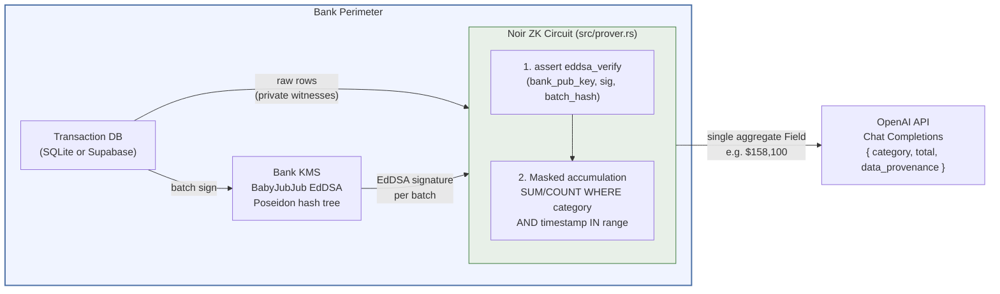
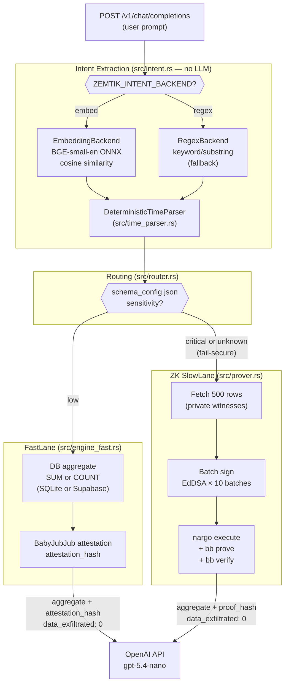
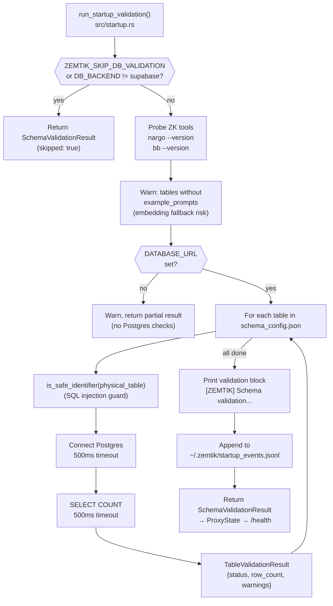
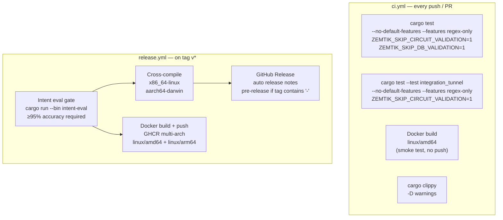

# Zemtik Architecture

**Document type:** Explanation + Reference  
**Audience:** Bank CISOs, enterprise security architects, and technical evaluators  
**Goal:** Understand how Zemtik guarantees zero raw data exfiltration to external AI systems  

**Scope note:** This document is aligned with **v0.13.0** (see `CHANGELOG.md`). The ZK slow-lane cryptography is unchanged in spirit from earlier releases.

- **v0.3.0–v0.4.0:** Intent extraction, routing, and FastLane middleware
- **v0.5.x:** Timing instrumentation, Poseidon caching, outgoing prompt hash tracking, sidecar manifests, configurable `bb verify` timeout
- **v0.6.0:** Supabase FastLane connector, configurable bind/CORS, multi-client support, `bb` process kill on timeout, hardened Supabase defaults
- **v0.7.0:** Universal FastLane engine (`schema_config.json` sensitivity routing); `AggFn` enum (SUM/COUNT); new `TableConfig` fields (`value_column`, `timestamp_column`, `category_column`, `agg_fn`, `metric_label`, `skip_client_id_filter`, `physical_table`); `attest_fast_lane()` public API; `signing_version: 2`; ISSUE-001 fix (`DB_BACKEND=sqlite` ignored when Supabase creds were set)
- **v0.8.0:** `AggFn::Avg` (ZK composite: two sequential proofs + attestation); mini-circuit layout (`circuit/sum/`, `circuit/count/`, `circuit/lib/`); variable row-count padding; `actual_row_count` field; `evidence_version: 2`; receipts DB v5 migration; per-agg pipeline locks
- **v0.13.2:** `evidence_version: 3`; `human_summary` and `checks_performed` fields on `EvidencePack`; `evidence_summary()` helper with shared const check names
- **v0.8.2:** Docker support (multi-stage build, non-root user), `docker-compose.yml`; CI pipeline (`ci.yml`); `build_proxy_router()` extracted; `ZEMTIK_OPENAI_BASE_URL` + `ZEMTIK_OPENAI_MODEL` + `ZEMTIK_SKIP_CIRCUIT_VALIDATION` `ZEMTIK_*` env vars; integration tests (`tests/integration_proxy.rs`)
- **v0.9.0:** Tunnel Mode (`ZEMTIK_MODE=tunnel`): FORK 1 + FORK 2 passthrough + background ZK; `TunnelAuditRecord` persistence; `TunnelMatchStatus` (six variants: `Matched`, `Diverged`, `Unmatched`, `Error`, `Timeout`, `Backpressure`); dashboard endpoints (`/tunnel/audit`, `/tunnel/summary`)
- **v0.9.1:** `src/startup.rs` (Postgres column/row validation, ZK tools detection, `example_prompts` warnings, JSONL event log); `ZEMTIK_SKIP_DB_VALIDATION` + `ZEMTIK_VALIDATE_ONLY` `ZEMTIK_*` env vars; `ZemtikErrorCode` enum (`NoTableIdentified`, `StreamingNotSupported`, `InvalidRequest`, `QueryFailed`); streaming guard; `/health` `schema_validation` object; security fixes S1 (`danger_accept_invalid_certs` removed), S2 (`is_safe_identifier` on schema keys), S3 (Postgres errors suppressed from HTTP responses)
- **v0.10.0:** Hybrid query rewriter (`ZEMTIK_QUERY_REWRITER`): deterministic multi-turn resolution + LLM fallback; per-table `query_rewriting` flag; receipts DB v6 migration (`rewrite_method`, `rewritten_query` columns)
- **v0.11.0:** General Passthrough lane (`ZEMTIK_GENERAL_PASSTHROUGH`): non-data queries forwarded to OpenAI with receipt and `zemtik_meta` block; `ZEMTIK_GENERAL_MAX_RPM` rate limiter; `X-Zemtik-Engine` response header on all lanes
- **v0.13.0:** MCP Attestation Proxy (`src/mcp_proxy.rs`, `src/mcp_auth.rs`, `src/mcp_tools.rs`): wraps every MCP tool call with ZK-backed attestation; stdio transport (`zemtik mcp`, Claude Desktop) and Streamable HTTP transport (`zemtik mcp-serve`, `:4001`); `McpAuditRecord` persistence in `mcp_audit.db`; `ZEMTIK_MCP_MODE=tunnel|governed`; built-in tools (`zemtik_fetch`, `zemtik_read_file`) with path/domain allowlists; dynamic tool registration via `mcp_tools.json`

---

## The Problem Zemtik Solves

Financial institutions accumulate petabytes of transaction data that could generate competitive intelligence through AI analysis. The obstacle is contractual, regulatory, and fiduciary: raw ledger data cannot leave the enterprise perimeter. Sending individual transactions to a third-party LLM violates data residency rules, client confidentiality agreements, and in many jurisdictions, financial privacy law.

Existing workarounds (on-premises LLMs, data anonymization, synthetic data) involve substantial infrastructure cost, accuracy loss, or both.

Zemtik takes a different approach: **compute the answer locally, prove the computation was honest (or attest it on a lighter path), and send only the aggregate and provenance metadata to the LLM.**

---

## Core Guarantee

> **Zero raw transaction rows are transmitted to OpenAI at any point in the pipeline.**

What reaches the model is a deliberately small JSON summary: at minimum the aggregate metric, the category or table label, and a provenance tag (`ZEMTIK_VALID_ZK_PROOF` on the ZK path, `ZEMTIK_FAST_LANE_ATTESTATION` on FastLane). The proxy **merges a top-level `evidence` object** into the Chat Completions JSON returned to the client (serialized `EvidencePack` plus `engine` and `intent` summaries for tooling). The substituted user message to OpenAI still carries the same aggregate payload as before. None of these structures contain row-level ledger fields.

The mathematical mechanism for the **ZK slow lane** is described below. The **FastLane** path uses the same BabyJubJub EdDSA signing machinery over commitments, but skips full UltraHonk proof generation; it is gated to non-critical tables by policy in `schema_config.json`.

---

## Architecture Overview (ZK Slow Lane)

The diagram below is the trust boundary for **critical** queries: batches of signed transactions stay inside the perimeter until reduced to a single verified sum.



---

## Operational Modes

| Mode | Command | Role |
|------|---------|------|
| CLI pipeline | `cargo run` (default) | One-shot demo: seed 500 txs → batch sign → `nargo execute` → optional UltraHonk proof → OpenAI |
| Proxy | `cargo run -- proxy` | Axum server (default `:4000`): intercepts `POST /v1/chat/completions`, runs intent → router → FastLane or ZK slow lane |
| Verify | `cargo run -- verify <bundle.zip>` | Offline `bb verify` on a portable proof bundle |
| List | `cargo run -- list` | Prints recent rows from `~/.zemtik/receipts.db` (includes `intent_confidence` where present) |
| List-tunnel | `cargo run -- list-tunnel` | Prints recent tunnel audit records from `~/.zemtik/tunnel_audit.db` |
| Tunnel proxy | `ZEMTIK_MODE=tunnel cargo run -- proxy` | Transparent passthrough proxy: FORK 1 forwards all traffic unmodified; FORK 2 runs ZK verification in background and logs `TunnelAuditRecord` |
| MCP stdio | `cargo run -- mcp` | MCP attestation proxy over stdio; integrates with Claude Desktop; wraps every tool call with ZK attestation; logs `McpAuditRecord` to `mcp_audit.db` |
| MCP HTTP | `cargo run -- mcp-serve` | MCP attestation HTTP server on `:4001` (Streamable HTTP transport) for IDE/CI integrations |
| List-mcp | `cargo run -- list-mcp` | Prints recent MCP audit records from `~/.zemtik/mcp_audit.db` |

External toolchain on PATH: **Noir** `nargo` (1.0.0-beta.19), **Barretenberg** `bb` (v4.x / UltraHonk; project docs use `v4.0.0-nightly`).

---

## Proxy Data Flow (v0.3+)

Natural-language prompts are interpreted **without calling an LLM** for routing. v0.4.0 adds an embedding-based matcher; v0.3.0 regex logic remains available as fallback.



**Configuration:** `schema_config.json` lives at `~/.zemtik/schema_config.json` in normal deployments; `schema_config.example.json` is the template. Embedding mode expects each table to include `description` and `example_prompts`; missing fields warn and fall back to `RegexBackend`.

**Environment (intent):** `ZEMTIK_INTENT_BACKEND` (`embed` | `regex`, case-insensitive), `ZEMTIK_INTENT_THRESHOLD` (default cosine threshold 0.65).

---

## Source Module Map (`src/`)

| Module | Responsibility |
|--------|------------------|
| `main.rs` | CLI routing: pipeline, `proxy`, `verify`, `list`, `list-tunnel`; `ZEMTIK_VALIDATE_ONLY` exit path |
| `proxy.rs` | HTTP proxy, FastLane / ZK dispatch, receipt headers |
| `intent.rs` | `IntentBackend` trait, `RegexBackend`, dispatch to embed backend |
| `intent_embed.rs` | `EmbeddingBackend`, schema index, cosine match |
| `time_parser.rs` | `DeterministicTimeParser` (quarters, FY, months, relative, YTD, etc.) |
| `router.rs` | `FastLane` vs `ZkSlowLane` from table sensitivity |
| `engine_fast.rs` | FastLane: generic `aggregate_table()` (SUM or COUNT) → `attest_fast_lane()` (`signing_version: 2`) |
| `evidence.rs` | `EvidencePack` for both engines |
| `db.rs` | SQLite / Supabase, seeding, signing, `aggregate_table()` / `query_aggregate_table()` (generic SUM/COUNT; `sum_by_category` deprecated v0.7.0), category codes for circuit |
| `prover.rs` | `nargo` / `bb` subprocess pipeline |
| `verify.rs` / `bundle.rs` | Bundle ZIP + offline verification |
| `openai.rs` | Chat Completions client |
| `config.rs` | Layered config + schema load |
| `receipts.rs` | SQLite receipts (v5: adds `actual_row_count`; v3: `outgoing_prompt_hash`; v2: `engine_used`, `proof_hash`, `data_exfiltrated`, `intent_confidence`) |
| `keys.rs` | BabyJubJub key at `~/.zemtik/keys/bank_sk` (0600) |
| `types.rs` | `IntentResult`, `Route`, `EngineResult`, `EvidencePack`, `ZemtikErrorCode`, `TunnelMatchStatus`, … |
| `audit.rs` | JSON audit records under `audit/` |
| `startup.rs` | Startup schema validation: Postgres column/row checks per table, ZK tools detection, `example_prompts` warnings, JSONL event log |
| `tunnel.rs` | Tunnel mode: FORK 1 (transparent forward, streaming), FORK 2 (background ZK verification), `TunnelAuditRecord` persistence, diff computation |

Layered config order: defaults → `~/.zemtik/config.yaml` → env (`ZEMTIK_*`, `OPENAI_API_KEY`, `DB_BACKEND`, …) → CLI flags (`--port`, `--circuit-dir`).

---

## Component Deep-Dive

### 1. Configuration and schema (`config.rs`)

Runtime paths and API keys are merged from the layers above. Proxy mode **requires** a valid `schema_config.json` so tables have sensitivity, aliases, and fiscal-year settings. The embedding backend additionally indexes human-readable `description` and `example_prompts` per table.

### 2. Intent and time (`intent.rs`, `intent_embed.rs`, `time_parser.rs`)

- **Embedding path:** Builds a fixed schema index at startup, embeds the user prompt, returns the best-matching table key with a **confidence** score (`IntentResult.confidence`). Evaluated against `eval/labeled_prompts.json` via `cargo run --bin intent-eval --features eval` (release CI gate; see CHANGELOG for accuracy thresholds).
- **Regex path:** Deterministic keyword-style matching, no ONNX.
- **Time:** Parsed from the same prompt string; unrecognized time phrases yield `TimeRangeAmbiguous` and conservative routing.

Confidence flows into `EvidencePack.zemtik_confidence` and the `receipts` table (`intent_confidence`).

### 3. Routing (`router.rs`)

Each table declares sensitivity (e.g. `critical` vs `low`). **Critical** (and unknown tables, fail-secure) use the ZK slow lane. **Non-critical** tables use FastLane.

### 4. FastLane (`engine_fast.rs`)

FastLane is the sub-50ms execution path for tables with `"sensitivity": "low"`. It performs a direct database aggregate and attests the result with BabyJubJub EdDSA — **no Noir circuit is compiled, no UltraHonk proof is generated**.

**Aggregate query.** `aggregate_table()` (SQLite) or `query_aggregate_table()` (Supabase PostgREST) runs a single SQL aggregate. The exact query shape is controlled by `TableConfig` fields: `agg_fn` (SUM or COUNT), `value_column`, `timestamp_column`, `category_column`, and `skip_client_id_filter`. Individual transaction rows are never fetched — only the final `(aggregate, row_count)` pair leaves the DB layer.

**Attestation — `attest_fast_lane()`.** Signs the aggregate using the same BabyJubJub key as the ZK path:

```
payload = SHA-256(
    category_name ||
    start_time_le || end_time_le ||
    aggregate_le || row_count_le || timestamp_now_le ||
    resolved_table ||
    value_column || timestamp_column || category_column_or_empty ||
    agg_fn || metric_label ||
    effective_client_id_le
)
payload_bn254 = le_bytes_to_integer(payload) mod BN254_FIELD_ORDER
(sig_r8_x, sig_r8_y, sig_s) = BabyJubJub EdDSA sign(bank_sk, payload_bn254)
attestation_hash = SHA-256("{sig_r8_x}:{sig_r8_y}:{sig_s}")
```

`signing_version: 2` (introduced in v0.7.0) identifies this descriptor-bound format, distinguishing it from the earlier v1 format (category-only attestation). The `attestation_hash` is included in the `EvidencePack`, but FastLane receipts do not persist it to `receipts.db`: the FastLane write path records `proof_hash: None` in `src/proxy.rs`. Only non-FastLane (v2 ZK) receipts persist the attestation/proof hash in `receipts.db`.

**Trust model — important limitation.** The attestation binds the aggregate to the institution's signing key and the query descriptor, but there is no circuit constraint. A malicious operator with access to `bank_sk` could call `attest_fast_lane()` with an arbitrary aggregate value without ever querying the database. FastLane is appropriate only when (a) the aggregate is non-sensitive and (b) the institution controls the Zemtik process end-to-end. For sensitive tables, use `"sensitivity": "critical"` to force the ZK SlowLane path.

**Concurrency.** FastLane does not hold the global ZK `pipeline_lock`. Multiple FastLane requests can be served concurrently without contention.

**Database backend.** Works against both `DB_BACKEND=sqlite` (in-memory seeded ledger) and `DB_BACKEND=supabase` (PostgREST). The Supabase path uses `query_aggregate_table()`, which speaks the PostgREST HTTP protocol. `DB_BACKEND=supabase` must be set explicitly — having Supabase credentials without this env var keeps the SQLite path active (ISSUE-001 fix, v0.7.0).

### 5. The Bank Ledger (`src/db.rs`)

`DB_BACKEND` selects storage:

- **`sqlite`** (default): in-memory SQLite for development and CLI demo. FastLane uses this in local/dev mode.
- **`supabase`**: PostgreSQL via PostgREST + direct Postgres for DDL.

Production expectation: a read-only adapter to the bank’s real ledger.

**Schema (both backends):**

```sql
CREATE TABLE transactions (
    id        BIGINT PRIMARY KEY,
    client_id BIGINT NOT NULL,
    amount    BIGINT NOT NULL,    -- in USD
    category  BIGINT NOT NULL,    -- 1=Payroll, 2=AWS, 3=Coffee
    timestamp BIGINT NOT NULL     -- UNIX seconds
);
```

The POC seeds **500** transactions (10 batches × 50) for `client_id = 123` across Q1 2024. Both backends share `generate_seed_transactions()` so hashes and proofs stay reproducible.

### 6. The Bank KMS Mock (`src/db.rs`, batch signing)

Before use in the circuit, transaction batches are signed with **BabyJubJub EdDSA** and **Poseidon** commitments (same construction as the original POC). The commitment tree is documented in the Noir section below.

### 7. The ZK Circuits (`circuit/`)

Mini-circuit layout (v0.8.0). Three Noir packages:

| Directory | Purpose |
|-----------|---------|
| `circuit/sum/` | SUM mini-circuit — computes `SUM(amount)` per batch; used by SUM and AVG queries |
| `circuit/count/` | COUNT mini-circuit — computes `COUNT(non-null rows)` per batch; used by COUNT and AVG queries |
| `circuit/lib/` | Shared Noir library — Poseidon tree construction, EdDSA verify wrapper |

**Each mini-circuit** (Noir 1.0.0-beta.19) processes **`BATCH_COUNT` = 10** batches of **`TX_COUNT` = 50** transactions (500 rows total, padded with sentinel transactions when the actual result set is smaller). Each batch has its own Poseidon commitment and EdDSA signature (`BatchInput`).

**Public inputs (both circuits):** `target_category_hash`, `start_time`, `end_time`, `bank_pub_key_x`, `bank_pub_key_y`.  
**Private inputs:** `batches: [BatchInput; 10]` (rows + `sig_s`, `sig_r8_x`, `sig_r8_y` per batch).  
**Return value (public):** single `Field` — the aggregate across all 10 batches (total sum or total count).

Per batch: reconstruct 4-level Poseidon tree → `eddsa_verify::<PoseidonHasher>` → branchless masked accumulation over the 50 rows.

**AVG composite:** `proxy.rs` runs the SUM circuit then the COUNT circuit sequentially (under separate per-agg locks), then computes `avg = sum / count` in Rust and signs the triple `(sum, count, avg)` with BabyJubJub. The response carries a single `proof_hash` (built by `build_evidence_pack()` in `src/evidence.rs`) and sets `avg_evidence_model: "zk_composite+attestation"`.

### 8. The Noir Pipeline (`src/prover.rs`)

| Command | Purpose |
|---------|---------|
| `nargo compile` | ACIR bytecode |
| `nargo execute` | Witness + full constraint satisfaction |
| `bb prove` (UltraHonk) | ZK proof |
| `bb verify` | Verifies proof + VK |

`nargo execute` alone is a complete soundness check for the constraints; proof generation may be skipped or fail on CRS limits while execute still succeeds.

### 9. Receipts, Bundles, and Verify (`receipts.rs`, `bundle.rs`, `verify.rs`)

ZK slow lane writes portable ZIP bundles under `~/.zemtik/receipts/` and rows in `receipts.db` (engine used, proof hash, prompt/request hashes, `intent_confidence` in v2, `outgoing_prompt_hash` in v3). Bundles at `bundle_version >= 2` include a `manifest.json` sidecar (SHA-256 of `public_inputs_readable.json`); `zemtik verify` enforces manifest presence for these bundles. **`cargo run -- verify`** replays `bb verify` on a bundle. The HTTP proxy also exposes a receipt viewer route for bundle ids (see `proxy.rs`).

### 10. Health Endpoint (`GET /health`)

Returns a JSON object with proxy status, version, and (v0.9.1+) the startup validation result:

```json
{
  "status": "ok",
  "version": "0.9.1",
  "schema_validation": {
    "status": "ok",
    "skipped": false,
    "zk_tools": { "nargo": true, "bb": true },
    "tables": [
      { "table_key": "aws_spend", "physical_table": "aws_spend", "status": "ok",   "row_count": 500, "warnings": [] },
      { "table_key": "payroll",   "physical_table": "payroll",   "status": "warn", "row_count": 0,   "warnings": ["table is empty"] }
    ]
  }
}
```

`schema_validation.skipped: true` when `ZEMTIK_SKIP_DB_VALIDATION=1` or the backend is SQLite.

### 11. The OpenAI Client (`src/openai.rs` and proxy injection)

**CLI pipeline** sends a JSON payload including `period_start` / `period_end` and `data_provenance: "ZEMTIK_VALID_ZK_PROOF"` (see `openai.rs`).

**Proxy FastLane** replaces the last user message with a summary that includes an **`evidence`** object: engine name, `attestation_hash`, `schema_config_hash`, aggregate, `actual_row_count`, `receipt_id`, `zemtik_confidence`, `outgoing_prompt_hash`, `evidence_version: 3`, `human_summary` (plain-language compliance narrative), `checks_performed` (ordered list of checks), and `data_exfiltrated: 0`.

**Proxy ZK slow lane** injects the same compact summary into the last user message for the model, and adds the same top-level **`evidence`** object on the HTTP response as FastLane (ZK `proof_hash`, `engine_used`, `intent`, `outgoing_prompt_hash`, etc.). `outgoing_prompt_hash` is `None` when `fully_verifiable=false` (no proof artifact exists). Receipt metadata captures `proof_hash`, confidence, and `outgoing_prompt_hash` server-side.

In all cases, individual transaction amounts, timestamps, and client identifiers stay out of the outbound LLM payload.

---

---

## Data Ingestion & Aggregation: From SQL to Zero-Knowledge

This section walks through exactly what happens when Zemtik processes a real query against a real database — from the SQL schema through to the payload sent to the LLM. No magic.

### Step 0: Schema Conformance

v1 requires your table to expose five columns with these exact names and types. Additional columns (PII, metadata, signatures) are harmlessly ignored.

```sql
-- Your enterprise table. Zemtik only touches the five columns below.
CREATE TABLE transactions (
    id            BIGINT PRIMARY KEY,
    client_id     BIGINT        NOT NULL,  -- tenant / cost-centre identifier
    amount        BIGINT        NOT NULL,  -- integer currency units (e.g. USD cents)
    category_name VARCHAR(93)   NOT NULL,  -- must match a key in schema_config.json
    timestamp     BIGINT        NOT NULL,  -- UNIX epoch seconds

    -- Everything below is ignored by Zemtik's query — it never appears in SELECT
    user_name     TEXT,                    -- PII: never read, never signed, never sent
    description   TEXT,                    -- free-text: same
    db_signature  TEXT                     -- your own DB-level integrity field: same
);
```

The `category_name` values must match the keys you declare in `schema_config.json`. Zemtik converts each key to a BN254 field element via `poseidon_of_string(key)` — trim + lowercase → three 31-byte chunks → `bn254::hash_3`. The Noir circuit receives this hash as a public input and uses it to filter rows without ever seeing the string itself.

**The only SQL Zemtik executes is:**

```sql
-- FastLane (aggregate only — no rows ever leave the DB layer):
-- Query shape is controlled by TableConfig: agg_fn (SUM/COUNT), value_column,
-- timestamp_column, category_column, and skip_client_id_filter.
-- Example for a SUM table with category and client_id filters:
SELECT SUM(amount), COUNT(*)
FROM   transactions
WHERE  category_name = $1          -- only when category_column is set
  AND  timestamp     >= $2         -- UNIX seconds from DeterministicTimeParser
  AND  timestamp     <= $3
  AND  client_id     = $4;         -- omitted when skip_client_id_filter=true

-- ZK SlowLane (fetches rows for private-witness construction):
SELECT amount, category_name, timestamp
FROM   transactions
WHERE  client_id = $1
ORDER  BY id
LIMIT  500;                        -- hard limit: circuit accepts exactly 500 rows
```

### Step 1 (Fast Lane) — "What is the total marketing spend last quarter?"

Concretely, this is what executes at each layer.

**1. Intent extraction** (`src/intent.rs`, `src/intent_embed.rs`)

The proxy receives `POST /v1/chat/completions` with `"content": "What is the total marketing spend last quarter?"`.

- EmbeddingBackend encodes the prompt via BGE-small-en ONNX and runs cosine similarity over the schema index.
- `DeterministicTimeParser` (`src/time_parser.rs`) extracts `"last quarter"` → Q4 2025 → `(1727740800, 1735689599)` Unix seconds.
- Returns: `IntentResult { table: "marketing", time_range: (1727740800, 1735689599), confidence: 0.89 }`

**2. Routing** (`src/router.rs`)

```rust
// schema_config.json: "marketing": { "sensitivity": "low", ... }
decide_route(&intent, &schema) // → Route::FastLane
```

**3. Database query** (`src/db.rs::aggregate_table`)

The query is built dynamically from `TableConfig` (`value_column`, `timestamp_column`, `category_column`, `agg_fn`). For a SUM table with a category column this looks like:

```sql
SELECT SUM(amount), COUNT(*)
FROM   transactions
WHERE  category_name = 'marketing'
  AND  timestamp >= 1727740800
  AND  timestamp <= 1735689599
  AND  client_id = 123;
-- → (41200000, 47)   -- $412,000.00 in cents; 47 matching rows
```

For a COUNT table with `skip_client_id_filter: true` and no `category_column` (e.g. `new_hires`), the query omits those filters and uses `COUNT(employee_id)` instead.

Individual rows, `user_name`, and `description` are **never fetched**.

**4. Attestation** (`src/engine_fast.rs::attest_fast_lane`)

```
SHA-256(
  "marketing" ||
  1727740800_le || 1735689599_le ||
  41200000_le || 47_le || now_le ||
  "transactions" ||
  "amount" || "timestamp" || "category" ||
  "SUM" || "total spend" ||
  123_le
)
  → 32-byte payload hash

le_bytes_to_integer(payload_hash) mod BN254_FIELD_ORDER
  → signing scalar

BabyJubJub EdDSA sign(bank_sk, signing scalar)
  → (sig_r8_x, sig_r8_y, sig_s)

attestation_hash = SHA-256("{sig_r8_x}:{sig_r8_y}:{sig_s}")
```

**5. OpenAI payload (what actually crosses the perimeter)**

```json
{
  "role": "user",
  "content": "The verified aggregate for marketing (Q4 2025) is $412,000.\nEvidence: { \"engine\": \"fastlane\", \"aggregate\": 412000, \"row_count\": 47, \"data_exfiltrated\": 0, \"attestation_hash\": \"a3f9...\" }"
}
```

What is **not** in the payload: no `user_name`, no individual transaction amounts, no timestamps, no account identifiers.

Total latency: **< 50 ms**.

---

### Step 2 (ZK Slow Lane) — "What is the total payroll this quarter?"

**1. Intent + routing**

Same extraction as above. `schema_config.json` has `"payroll": { "sensitivity": "critical" }`.

```rust
decide_route(&intent, &schema) // → Route::ZkSlowLane
```

**2. Fetch private witnesses** (`src/db.rs::query_transactions`)

```sql
SELECT amount, category_name, timestamp
FROM   transactions
WHERE  client_id = 123
ORDER  BY id
LIMIT  500;
-- Returns up to 500 rows — the hard circuit limit.
-- If your query window contains > 500 rows the pipeline will error.
-- See SCALING.md for the production multi-batch path.
```

Rows stay **inside the Rust process** as in-memory structs. They are private witnesses — never written to disk, never sent over the network.

**3. Category hash** (`src/db.rs::poseidon_of_string`)

```
"payroll"
  → trim + lowercase → b"payroll" (7 bytes)
  → zero-pad to 3 × 31-byte chunks: [chunk0=b"payroll\x00...", chunk1=0, chunk2=0]
  → bn254::hash_3([chunk0, chunk1, chunk2])
  → Field(0x1d3f...)   ← target_category_hash (PUBLIC input to circuit)
```

**4. Batch signing** — 500 rows → 10 batches of 50 (`src/db.rs::sign_transaction_batches`)

For each batch:

```
L1: hash_3([amount_i, category_hash_i, timestamp_i])  × 50 rows
L2: hash_5([L1[0..4]]),  hash_5([L1[5..9]]),  …       × 10
L3: hash_5([L2[0..4]]),  hash_5([L2[5..9]])            × 2
L4: hash_2([L3[0], L3[1]])                             → batch_commitment

sig = EdDSA_sign(bank_sk, batch_commitment)
    → (sig_s, sig_r8_x, sig_r8_y)
```

**5. Witness file** (`src/prover.rs::generate_batched_prover_toml`) — written to a temp run directory, never persisted to `~/.zemtik/`

```toml
# Public inputs — visible to the verifier
target_category_hash = "8029374..."
start_time           = "1735689600"
end_time             = "1743465599"
bank_pub_key_x       = "11559732..."
bank_pub_key_y       = "17671386..."

# Private inputs — hidden from the verifier, never leave the process
[[batches]]
sig_s    = "2819374..."
sig_r8_x = "9182736..."
sig_r8_y = "1029384..."

[[batches.transactions]]
amount    = "12500000"    # $125,000.00 in cents
category  = "8029374..."  # poseidon_of_string("payroll") — same as target
timestamp = "1735689601"

[[batches.transactions]]
amount    = "7500000"     # $75,000.00
category  = "8029374..."
timestamp = "1735689602"
# ... 48 more rows in this batch; 9 more batches follow
```

**6. Noir circuit** (`circuit/src/main.nr`)

For each of the 10 batches, `process_batch()`:

1. Rebuilds the identical 4-level Poseidon commitment tree from the private transaction rows.
2. Runs `assert(eddsa_verify(bank_pub_key_x, bank_pub_key_y, sig_s, sig_r8_x, sig_r8_y, batch_commitment))`. If the data was tampered with, this assertion fails and no valid witness exists.
3. Accumulates a branchless masked sum:
   ```noir
   total += if (tx.category == target_category_hash)
               & (tx.timestamp >= start_time)
               & (tx.timestamp <= end_time)
            { tx.amount as Field } else { 0 };
   ```

`main()` sums the 10 partial aggregates and returns a single public `Field`.

**7. Proof generation**

```bash
nargo execute   # constraint check + witness; returns aggregate as hex
bb prove        # UltraHonk proof (728k gates, ~17s on CPU)
bb verify       # local soundness check before forwarding to OpenAI
```

**8. OpenAI payload (what actually crosses the perimeter)**

```json
{
  "role": "user",
  "content": "The ZK-verified aggregate for payroll (Q1 2025) is $4,250,000.\nEvidence: { \"engine\": \"zk_slowlane\", \"aggregate\": 4250000, \"data_exfiltrated\": 0, \"proof_hash\": \"7c3a...\" }"
}
```

**What the verifier (and OpenAI) learns:** the aggregate ($4,250,000), the category name, the time range, and the proof hash. **What stays private:** every individual payroll amount, every employee's `user_name`, every transaction timestamp, the batch signatures, and the private key.

---

### Step 3: Database Connectivity — What "Supabase" Actually Means

Zemtik v1 supports two `DB_BACKEND` values:

| `DB_BACKEND` | What it connects to | Use case |
|---|---|---|
| `sqlite` (default) | In-memory SQLite seeded with 500 demo rows | Local development, CLI demo |
| `supabase` | Your PostgreSQL via PostgREST REST API | Integration testing, early production |

**`DB_BACKEND=supabase` is not a raw Postgres connection.** It speaks the PostgREST HTTP protocol. Required env vars:

```bash
SUPABASE_URL=https://your-project.supabase.co   # PostgREST base URL
SUPABASE_SERVICE_KEY=eyJhbGci...                # Service-role JWT (Supabase dashboard → Settings → API)
```

If you are running your own Postgres (not Supabase), you need PostgREST deployed in front of it. The Zemtik Rust process never opens a raw Postgres socket in v1.

**Schema conformance:** The five required columns (`id`, `client_id`, `amount`, `category_name`, `timestamp`) must exist with those exact names. Zemtik does not do schema introspection or column aliasing. If your table uses `category_code` instead of `category_name`, you must add the column or rename it before connecting.

> **Roadmap:** A native `sqlx`-based Postgres connector (`DB_BACKEND=postgres`) that accepts a `DATABASE_URL` and a column-mapping config is planned for v2. Until then, self-hosted PostgREST is the integration path for non-Supabase deployments.

---

## Data Flow: CLI Pipeline (Default `cargo run`)

```
1. `AppConfig::load()` (config layers + paths)

2. `db::init_db()` → `query_transactions(client 123)` → 500 rows, 10 batches of 50

3. `keys::load_or_generate_key()`

4. `db::sign_transaction_batches()` (BabyJubJub EdDSA per batch)

5. `prover::generate_batched_prover_toml()`

6. `prover::compile_circuit()` (cached)

7. `prover::execute_circuit()` (constraint check + aggregate)

8. `prover::generate_proof()` + `prover::verify_proof()` (UltraHonk, CRS-dependent)

9. `bundle::generate_bundle()` + `receipts::insert_receipt()` when fully verifiable

10. `openai::query_openai(...)` (aggregate-only payload)

11. `audit::write_audit_record(...)`
```

Proxy mode replaces steps 2–10 with: **parse Chat Completions body → intent → router →** either FastLane handler or the same ZK pipeline as above keyed off extracted `IntentResult` (category + time range).

---

## Cryptographic Security Properties

### Soundness (ZK path)

A dishonest prover cannot forge a valid proof for a wrong aggregate without breaking the signature assumption on the Poseidon commitment: the witness must match a bank-signed message hash.

### Zero-knowledge

The proof reveals nothing about private rows beyond what public inputs and the aggregate imply.

### Completeness

Honest prover with valid signed data matching public inputs can produce a witness; proof generation additionally requires a sufficient CRS / `bb` environment.

### FastLane caveat

FastLane provides a BabyJubJub EdDSA attestation over the `(aggregate, query_descriptor)` pair — **not** a Zero-Knowledge proof. Key differences from the ZK path:

- **No circuit constraint.** There is no mathematical statement that the prover must satisfy. A malicious operator with the signing key could produce a valid attestation for an arbitrary aggregate without querying the database.
- **No offline verification.** FastLane responses cannot be independently verified with `bb verify`. An auditor can confirm the `attestation_hash` was produced by the institution's key, but cannot prove the aggregate was derived from real database rows.
- **Appropriate use.** FastLane is acceptable when the aggregate itself is non-sensitive and the institution trusts its own Zemtik deployment end-to-end (e.g., e-commerce revenue totals, public headcount figures). For sensitive tables, `"sensitivity": "critical"` forces the ZK path.

Policy (`schema_config.json` `"sensitivity"` field) is the only control that determines which path runs. Unknown tables always fall through to ZK SlowLane (fail-secure).

---

## Technology Stack

| Component | Technology | Notes |
|-----------|------------|--------|
| ZK circuit | Noir | 1.0.0-beta.19 |
| Proof system | Barretenberg UltraHonk | `bb` v4.x (nightly in CI / README) |
| EdDSA (Noir) | noir-lang/eddsa | vendored constraints |
| Orchestrator | Rust | edition 2021 |
| DB | rusqlite / Supabase | `DB_BACKEND` |
| Signing | babyjubjub-rs, poseidon-rs | BN254-aligned |
| HTTP | axum, reqwest | Proxy + OpenAI |
| Intent (embed) | fastembed 5, BGE-small-en ONNX | Optional feature `embed`; `regex-only` build skips |
| Eval | `intent-eval` binary | Feature `eval`; labeled prompts in `eval/labeled_prompts.json` |

---

## Known Limitations

1. **CRS / proof generation:** The full 500-transaction circuit (10 signed batches) is large; local SRS may be insufficient for `bb prove`. `nargo execute` still validates all constraints. Production should pin SRS or use a proving service.

2. **Deterministic demo key:** Bank key is generated or loaded from disk for demos; production should use an HSM or KMS.

3. **Fixed batch geometry:** `TX_COUNT` and `BATCH_COUNT` are compile-time constants (currently 50 × 10 = 500 rows). Changing capacity requires recompiling the circuit and regenerating artifacts.

4. **Query expressiveness:** ZK SlowLane supports SUM, COUNT, and AVG (composite). AVG runs two sequential proofs (~40–120s). MIN/MAX, GROUP BY, and multi-table JOINs require new circuit variants and are not supported.

5. **Public inputs sidecar:** Human-readable metadata in bundles is not separately committed inside the circuit (documented in verifier UX); rely on `bb verify` for proof / VK / binary public inputs.

6. **`bb verify` process cleanup:** `ZEMTIK_VERIFY_TIMEOUT_SECS` (default 120s) bounds how long the proxy waits for `bb verify`. A timeout returns HTTP 504 and kills and reaps the `bb` child process (fixed in v0.6.0 via `poll_child_with_timeout`). (Resolved: unbounded wait prior to v0.5.2; orphaned process prior to v0.6.0.)

7. **Universal category hash (Sprint 2):** The circuit uses a Poseidon BN254 hash of the table key string instead of a hardcoded integer code. Any table defined in `schema_config.json` can run the ZK slow lane without a code change. The hash is computed by `poseidon_of_string()` in `db.rs` and verified cross-language against Noir `bn254::hash_3`.

8. **FastLane data source:** FastLane supports two backends. With `DB_BACKEND=sqlite` (default), it queries the in-memory seeded SQLite ledger via `aggregate_table()`. With `DB_BACKEND=supabase` (and `SUPABASE_URL` + `SUPABASE_SERVICE_KEY` set), it queries PostgREST via `query_aggregate_table()` and signs the aggregate. The Supabase path is now fully generic (SUM/COUNT, any table) as of v0.7.0. Note: `DB_BACKEND=supabase` must be set explicitly — having Supabase credentials without this env var keeps the SQLite path active (ISSUE-001 fix, v0.7.0).

9. **Embedding model:** First proxy start may download ~130MB ONNX to `~/.zemtik/models/`; air-gapped deploys can set `ZEMTIK_INTENT_BACKEND=regex`.

---

## Startup Validation (v0.9.1)

`src/startup.rs::run_startup_validation()` runs once at proxy startup (before accepting requests) and exposes results via `/health`. It is non-blocking — warnings do not prevent the server from starting.



**Skip paths:** `ZEMTIK_SKIP_DB_VALIDATION=1` skips all validation (required in Docker and integration tests where Postgres is unavailable). Non-Supabase backends (SQLite) skip automatically.

**`ZEMTIK_VALIDATE_ONLY=1`:** Runs the full startup validation, prints results, then exits with code `0` (all OK) or `1` (any warnings). Analogous to `nginx -t` — useful for pre-deployment config verification.

---

## Structured Error Codes (v0.9.1)

All proxy error responses (`4xx` / `5xx`) include a structured body:

```json
{
  "error": {
    "type": "zemtik_intent_error",
    "code": "NoTableIdentified",
    "message": "Could not identify a target table from the prompt.",
    "hint": "Check that schema_config.json has a table matching your query.",
    "doc_url": "https://github.com/.../docs/TROUBLESHOOTING.md"
  }
}
```

| Code | HTTP | Trigger | `type` |
|------|------|---------|--------|
| `StreamingNotSupported` | 400 | `stream: true` in standard proxy mode | `zemtik_config_error` |
| `InvalidRequest` | 400 | Empty or unreadable user message | `zemtik_config_error` |
| `NoTableIdentified` | 400 | Intent extraction returns no table | `zemtik_intent_error` |
| `QueryFailed` | 500 | Database query error | `zemtik_db_error` |

Raw Postgres error strings are **never** included in HTTP responses (S3 fix). Server-side errors are logged to stderr; the response body says "check server logs" with a link to `TROUBLESHOOTING.md`.

**Streaming note:** `stream: true` in standard mode returns HTTP 400 with `StreamingNotSupported`. Tunnel mode is excluded from this guard — it forwards streaming requests (including SSE) to OpenAI unmodified via FORK 1.

---

## Security Hardening (v0.9.1)

Three security fixes landed in v0.9.1:

- **S1 — TLS verification restored (`src/db.rs`):** `danger_accept_invalid_certs(true)` was removed from the Supabase client in `ensure_supabase_table()`. Supabase uses valid CA-signed certificates; the prior bypass created a MitM window for anyone on the network path.
- **S2 — SQL identifier validation on schema keys (`src/config.rs`):** `is_safe_identifier()` (now `pub(crate)`) is applied to all `schema_config.json` table keys during `validate_schema_config()` at startup, not just to column names. A malformed key such as `"aws; DROP TABLE transactions--"` is rejected before it can reach a SQL query.
- **S3 — No raw Postgres errors in HTTP responses (`src/proxy.rs`):** Database errors caught by the proxy are logged to stderr with full detail; the HTTP response body contains only a generic `QueryFailed` code and a doc link. No raw `pq: ...` or driver error strings are exposed to callers.

---

## CI/CD Pipeline



Postgres 16 service container is available in CI for future DB integration tests. `ZEMTIK_SKIP_DB_VALIDATION=1` is set in all test jobs to skip startup schema validation when `DATABASE_URL` is absent.

---

## Running the POC

```bash
# Prerequisites: nargo 1.0.0-beta.19, bb v4 (UltraHonk), Rust stable
cp .env.example .env
# Set OPENAI_API_KEY in .env or ~/.zemtik/config.yaml

cargo build --release

# Default: full CLI ZK pipeline (500 txs, Q1 2024, aws_spend category)
cargo run

# OpenAI-compatible proxy (needs ~/.zemtik/schema_config.json)
cargo run -- proxy

# Offline bundle check
cargo run -- verify path/to/bundle.zip

# Receipt ledger
cargo run -- list
```

**Typical CLI output shape:** `[DB]` ledger init, `[KMS]` batch signing, `[NOIR]` compile/execute, optional `[NOIR] Generating UltraHonk proof (bb v4, CRS auto-download)...`, `[AI]` with aggregate-only payload and `Raw rows sent to OpenAI: 0`.

For supported natural-language patterns in proxy mode, see `docs/SUPPORTED_QUERIES.md`.
