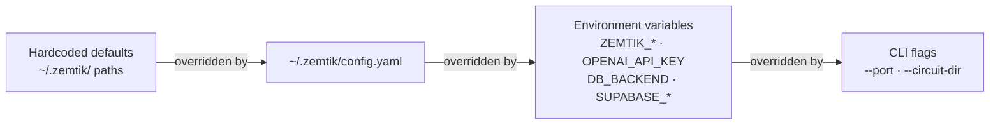

# Configuration Reference

**Document type:** Reference
**Audience:** Developers and operators deploying Zemtik
**Goal:** Complete, authoritative list of every configuration option, its type, default, and effect

---

## Configuration layers

Zemtik resolves configuration in this order, with later sources overriding earlier ones:

1. Hardcoded defaults (paths under `~/.zemtik/`)
2. YAML file (`~/.zemtik/config.yaml`)
3. Environment variables (`ZEMTIK_*` prefix and others below)
4. CLI flags (`--port`, `--circuit-dir`)

You can mix layers freely. Most deployments use only `.env` + `schema_config.json`.



---

## Environment variables

### Required

| Variable | Description |
|----------|-------------|
| `OPENAI_API_KEY` | OpenAI API key. Required for the CLI pipeline and proxy's forward-to-OpenAI step. |

### Database

| Variable | Default | Values | Description |
|----------|---------|--------|-------------|
| `DB_BACKEND` | `sqlite` | `sqlite`, `supabase` | Selects the transaction storage backend. |
| `SUPABASE_URL` | — | `https://your-project.supabase.co` | Required when `DB_BACKEND=supabase`. |
| `SUPABASE_SERVICE_KEY` | — | Supabase service-role JWT | Required when `DB_BACKEND=supabase`. |
| `DATABASE_URL` | — | PostgreSQL connection string | Required for DDL (table creation) via direct Postgres when `DB_BACKEND=supabase`. |
| `SUPABASE_AUTO_CREATE_TABLE` | `0` | `0`, `1` | When `1`, creates the `transactions` table via direct Postgres on startup if it doesn't exist. Default is `0` — prevents accidental DDL against a client production database. Set to `1` for local dev. |
| `SUPABASE_AUTO_SEED` | `0` | `0`, `1` | When `1`, inserts 500 demo transactions on startup. Default is `0` — prevents demo rows from being silently inserted into a client production database. Set to `1` for local dev. |

### Proxy server (v0.6.0+)

| Variable | Default | Values | Description |
|----------|---------|--------|-------------|
| `ZEMTIK_BIND_ADDR` | `127.0.0.1:4000` | `host:port` | Address the proxy listens on. Set to `0.0.0.0:4000` to expose on all interfaces (requires auth middleware — see TODOS). |
| `ZEMTIK_CORS_ORIGINS` | `http://localhost:4000` | Comma-separated URLs or `*` | Allowed CORS origins. Use `*` for wildcard (mixes with specific origins — wildcard takes precedence). |
| `ZEMTIK_CLIENT_ID` | `123` | integer | Default client ID for DB filtering. Overridden per-table by `client_id` in `schema_config.json`. |

### Intent engine

| Variable | Default | Values | Description |
|----------|---------|--------|-------------|
| `ZEMTIK_INTENT_BACKEND` | `embed` | `embed`, `regex` | Intent extraction backend. `embed` uses BGE-small-en ONNX for semantic matching. `regex` uses keyword substring matching. Case-insensitive. |
| `ZEMTIK_INTENT_THRESHOLD` | `0.65` | `0.0`–`1.0` | Cosine similarity threshold for the embedding backend. Prompts below this confidence score return HTTP 400 `NoTableIdentified` — they are not routed to ZK SlowLane. |

### OpenAI client

| Variable | Default | Values | Description |
|----------|---------|--------|-------------|
| `ZEMTIK_OPENAI_BASE_URL` | `https://api.openai.com` | URL | Base URL for OpenAI API calls. Override in tests or dev to point at a mock server (e.g. `http://localhost:3000`). |
| `ZEMTIK_OPENAI_MODEL` | `gpt-5.4-nano` | model identifier | OpenAI model used in CLI pipeline and proxy forwarding. `gpt-5.4-nano` is the current default. Set to any Chat Completions-compatible model. |

### Query rewriting (v0.10.0+)

When intent extraction fails on the current message, the hybrid query rewriter attempts to resolve the request using conversation history. The rewriter is off by default and must be explicitly enabled.

| Variable | Default | Values | Description |
|----------|---------|--------|-------------|
| `ZEMTIK_QUERY_REWRITER` | `false` | `1`, `true` | Enables the hybrid query rewriter. When intent extraction fails, the rewriter first runs a deterministic pass over prior messages, then falls back to an LLM rewrite call if deterministic resolution fails. |
| `ZEMTIK_QUERY_REWRITER_MODEL` | `gpt-5.4-nano` | model identifier | OpenAI model used for the LLM rewrite fallback call. Defaults to the value of `ZEMTIK_OPENAI_MODEL`. |
| `ZEMTIK_QUERY_REWRITER_TURNS` | `6` | positive integer | Number of prior conversation turns included in the LLM rewriter context window. Higher values improve accuracy at the cost of more tokens per rewrite call. |
| `ZEMTIK_QUERY_REWRITER_SCAN_MESSAGES` | `5` | positive integer | Maximum number of prior user messages scanned by the deterministic resolution pass. The deterministic pass does not call the LLM. |
| `ZEMTIK_QUERY_REWRITER_TIMEOUT_SECS` | `10` | positive integer | Seconds allowed for the LLM rewrite call before returning `RewritingFailed` with hint `timeout`. Does not affect the deterministic pass (no network call). |
| `ZEMTIK_QUERY_REWRITER_MAX_CONTEXT_TOKENS` | `2000` | positive integer | Token budget for LLM rewriter context, estimated via character count divided by 4. Older messages are dropped first when the budget is exceeded. |

#### Per-table override: `query_rewriting`

Each table in `schema_config.json` can override the global `ZEMTIK_QUERY_REWRITER` setting with a `query_rewriting` field:

| `query_rewriting` value | Effect |
|------------------------|--------|
| absent (field omitted) | Follows the global `ZEMTIK_QUERY_REWRITER` env var |
| `true` | Rewriting enabled for this table, regardless of global setting |
| `false` | Rewriting disabled for this table, even when `ZEMTIK_QUERY_REWRITER=1` (fail-secure override) |

Use `"query_rewriting": false` on sensitive tables to prevent conversation history from being sent to the configured OpenAI endpoint for rewriting.

#### Data residency

When the LLM rewrite fallback runs, a constructed context window is sent to the OpenAI endpoint configured by `ZEMTIK_OPENAI_BASE_URL` using `OPENAI_API_KEY`. The context is built by `build_context()` from at most `ZEMTIK_QUERY_REWRITER_TURNS` most recent user and assistant turns — not all messages in the request body — and is further truncated to fit within the token budget set by `ZEMTIK_QUERY_REWRITER_MAX_CONTEXT_TOKENS` (estimated as total chars / 4). Only this bounded, truncated message history and the failing query text are sent externally. The rewritten query text produced by the LLM is logged to `receipts.db` in the `rewritten_query` column; raw database rows are never forwarded.

Zemtik never sends raw database rows during rewriting — only the bounded, truncated message history and the failing query text.

#### Tunnel mode interaction

`ZEMTIK_QUERY_REWRITER=1` with `ZEMTIK_MODE=tunnel` emits a WARN at startup: the rewriter has no effect in tunnel mode because tunnel mode forwards requests unmodified. Set `ZEMTIK_QUERY_REWRITER` only in standard proxy mode.

#### Production recommendation

Start with the deterministic path only. The deterministic pass resolves the table from prior messages and merges an explicit time expression from the current message — no LLM call, no network latency. Enable the LLM fallback (`ZEMTIK_QUERY_REWRITER=1`) only after confirming that deterministic resolution does not cover your users' query patterns. When enabling the LLM fallback, review the data residency note above with your compliance team.

---

### General Passthrough (v0.11.0+)

When intent extraction fails to match any configured table and rewriter exhaustion
is reached, the proxy normally returns HTTP 400 `NoTableIdentified`. Enabling
General Passthrough routes these requests to OpenAI directly and logs a receipt.

| Variable | Default | Values | Description |
|----------|---------|--------|-------------|
| `ZEMTIK_GENERAL_PASSTHROUGH` | `false` | `1`, `true` | Enable General Passthrough. Off by default — preserves existing 400 behavior. |
| `ZEMTIK_GENERAL_MAX_RPM` | `0` | positive integer | Max requests/minute for the general lane. `0` = unlimited. Per-instance (not cluster-wide). ⚠️ Production note: default is 0 (unlimited). Consider setting a limit to control OpenAI API costs when deploying `ZEMTIK_GENERAL_PASSTHROUGH` in production. |

**Quick start:**
```bash
export ZEMTIK_GENERAL_PASSTHROUGH=1
# optional rate limiter (e.g. 60 requests/min):
export ZEMTIK_GENERAL_MAX_RPM=60
cargo run -- proxy   # or restart your Docker container
```

**Test it:**
```bash
curl -X POST http://localhost:4000/v1/chat/completions \
  -H "Content-Type: application/json" \
  -H "Authorization: Bearer $OPENAI_API_KEY" \
  -d '{"model":"gpt-5.4-nano","messages":[{"role":"user","content":"Can you summarize the previous answer?"}]}'
```

Expected response (trimmed):
```json
{
  "id": "chatcmpl-...",
  "choices": [{"message": {"role": "assistant", "content": "..."}}],
  "zemtik_meta": {
    "engine_used": "general_lane",
    "zk_coverage": "none",
    "reason": "no_table_match",
    "receipt_id": "<uuid>"
  }
}
```

**400 error hint change:** The HTTP 400 `NoTableIdentified` response now includes a second hint:
> "If this is a non-data query (e.g. a follow-up question), enable
> `ZEMTIK_GENERAL_PASSTHROUGH=1` to route it through the general lane."

**SDK compatibility note:** `zemtik_meta` is injected as a top-level field
in the JSON response alongside `choices`, `usage`, and `id`. If your OpenAI
client uses strict schema validation (Pydantic, TypeScript strict mode), either:
- Configure your parser to ignore unknown fields (`extra="ignore"` in Pydantic)
- Read the response metadata from the `X-Zemtik-Meta` header instead (always present,
  same JSON payload as the body field, URL-encoded)

**Streaming:** When `stream: true` is set in the request body, `zemtik_meta` is
NOT injected into the SSE response body (SSE format does not support top-level JSON).
Use the `X-Zemtik-Meta` response header for streaming responses.

> **SDK access limitation:** Most OpenAI SDK clients (Python, JS/TS) do not expose
> raw HTTP response headers through their streaming interface. If you use
> `openai.ChatCompletion.create(stream=True)` or equivalent, you cannot read
> `X-Zemtik-Meta` without accessing the underlying HTTP client directly (e.g., via
> `httpx` response object). Plan accordingly if your streaming consumers need
> `engine_used` metadata.

**Response headers (v0.11.0+, all lanes):**
`X-Zemtik-Engine: <lane>` is now present on every response from the proxy,
including FastLane, ZK SlowLane, and GeneralLane. Cross-origin clients must
list it in their CORS allow/expose configuration. Same applies to `X-Zemtik-Meta`.

---

### Tunnel mode (v0.9.0+)

Set `ZEMTIK_MODE=tunnel` to enable transparent verification mode. See [docs/TUNNEL_MODE.md](TUNNEL_MODE.md) for full details.

| Variable | Default | Values | Description |
|----------|---------|--------|-------------|
| `ZEMTIK_MODE` | `standard` | `standard`, `tunnel` | Operating mode. `tunnel` enables transparent forwarding + background ZK verification. Unrecognized values are rejected at startup. |
| `ZEMTIK_TUNNEL_API_KEY` | — | OpenAI API key | **Required in tunnel mode.** Key forwarded to OpenAI in FORK 1 and used for FORK 2 verification calls. Proxy refuses to start if unset — ensures verification is billed to zemtik, not the pilot customer. |
| `ZEMTIK_TUNNEL_MODEL` | `gpt-5.4-nano` | model identifier | Model used by Zemtik's background verification pipeline. |
| `ZEMTIK_TUNNEL_TIMEOUT_SECS` | `180` | positive integer | Seconds FORK 2 is allowed to run before `match_status=timeout`. |
| `ZEMTIK_TUNNEL_SEMAPHORE_PERMITS` | `50` | positive integer | Max concurrent background verifications. Excess requests get `x-zemtik-verified: false`. |
| `ZEMTIK_DASHBOARD_API_KEY` | — | string | If set, `/tunnel/audit`, `/tunnel/audit/csv`, and `/tunnel/summary` require `Authorization: Bearer <key>`. |
| `ZEMTIK_TUNNEL_AUDIT_DB_PATH` | `~/.zemtik/tunnel_audit.db` | file path | Path to the SQLite audit database (WAL mode, separate from receipts.db). |

### Startup validation (v0.9.1+)

| Variable | Default | Values | Description |
|----------|---------|--------|-------------|
| `ZEMTIK_SKIP_DB_VALIDATION` | `0` | `0`, `1`, `true`, `yes`, `on` | When set, skips all startup Postgres schema validation (per-table column/row checks). Required in Docker and integration tests where `DATABASE_URL` is absent. FastLane and ZK queries are unaffected. |
| `ZEMTIK_VALIDATE_ONLY` | `0` | `0`, `1`, `true` | When set, runs the full startup validation, prints results, then exits with code `0` (all OK) or `1` (any warnings found). No server is started. Analogous to `nginx -t`. |

### ZK pipeline

| Variable | Default | Values | Description |
|----------|---------|--------|-------------|
| `ZEMTIK_VERIFY_TIMEOUT_SECS` | `120` | positive integer | Seconds the proxy waits for `bb verify` before returning HTTP 504. On timeout, the `bb` child process is killed and reaped (v0.6.0+). |
| `ZEMTIK_SKIP_CIRCUIT_VALIDATION` | `0` | `0`, `1`, `true` | When `1` or `true`, skips the startup check that verifies `nargo` and `bb` are on `PATH` and the circuit directory is present. Required in Docker (where ZK tools are not installed) and in integration tests. FastLane queries continue to work; ZK SlowLane queries will fail at proof time if tools are missing. |

### Runtime paths

Zemtik uses `~/.zemtik/` as its state directory. These variables override individual subdirectories:

| Variable | Default | Description |
|----------|---------|-------------|
| `ZEMTIK_CIRCUIT_DIR` | `~/.zemtik/circuit/` | Directory containing the compiled Noir circuit artifacts. |
| `ZEMTIK_RUNS_DIR` | `~/.zemtik/runs/` | Working directory for nargo/bb subprocess artifacts. |
| `ZEMTIK_KEYS_DIR` | `~/.zemtik/keys/` | Directory for the BabyJubJub private key (`bank_sk`). |
| `ZEMTIK_RECEIPTS_DIR` | `~/.zemtik/receipts/` | Directory for proof bundle ZIP files. |
| `ZEMTIK_DB_PATH` | `~/.zemtik/zemtik.db` | Path to the SQLite transaction database (used by SQLite backend). |
| `ZEMTIK_RECEIPTS_DB_PATH` | `~/.zemtik/receipts.db` | Path to the SQLite receipts ledger. |

---

## CLI flags

| Flag | Description |
|------|-------------|
| `--port <PORT>` | Port for proxy mode. Default: `4000`. |
| `--circuit-dir <PATH>` | Override `ZEMTIK_CIRCUIT_DIR` for this run. |

---

## `~/.zemtik/config.yaml`

An optional YAML file for values you don't want to set as environment variables. All keys mirror the environment variable names in lowercase with underscores.

```yaml
openai_api_key: sk-...
db_backend: sqlite
zemtik_intent_backend: embed
zemtik_intent_threshold: 0.65
```

---

## `schema_config.json`

Required for proxy mode. Zemtik loads this file from `~/.zemtik/schema_config.json`.

### Top-level fields

| Field | Type | Description |
|-------|------|-------------|
| `fiscal_year_offset_months` | integer | Shifts quarter boundaries by N months. `0` = calendar quarters. `9` = fiscal year starting October. |
| `tables` | object | Map from table key (string) to `TableConfig`. |

### `TableConfig` fields

| Field | Type | Required | Description |
|-------|------|----------|-------------|
| `sensitivity` | string | Yes | `"low"` routes to FastLane. `"critical"` routes to ZK SlowLane. Any other value is treated as `"critical"`. |
| `agg_fn` | string | No | Aggregation function. Default: `"SUM"`. Valid values: `"SUM"`, `"COUNT"`, `"AVG"` (uppercase, case-sensitive). SUM and COUNT route to ZK SlowLane for critical tables; AVG uses a composite ZK proof (SUM + COUNT proofs + BabyJubJub attestation). AVG is not supported on FastLane (low sensitivity) tables. |
| `value_column` | string | No | Column to aggregate. Default: `"amount"`. For COUNT, use a non-nullable column (primary key recommended). |
| `timestamp_column` | string | No | Column for time range filtering. Default: `"timestamp"`. **Must store time as UNIX epoch seconds (integer).** For PostgreSQL `timestamp`/`timestamptz` columns, add a generated column: `ALTER TABLE t ADD COLUMN ts_epoch BIGINT GENERATED ALWAYS AS (EXTRACT(EPOCH FROM created_at)::BIGINT) STORED;` then set `"timestamp_column": "ts_epoch"`. |
| `category_column` | string | No | Column for category filtering within the table. `null` = aggregate entire table. |
| `metric_label` | string | No | Label for the aggregate field in the LLM payload. Default: `"total_spend_usd"`. |
| `physical_table` | string | No | Physical DB table name. Default: the schema key. Supabase/PostgREST only — SQLite always uses `transactions`. |
| `skip_client_id_filter` | boolean | No | When `true`, omits `client_id` filter from queries. Aggregates across all tenants. Use only for single-tenant tables. Default: `false`. |
| `aliases` | string[] | No | Alternative names the intent engine uses to match this table. Case-insensitive substring matching. |
| `description` | string | Required for `embed` backend | Human-readable description of the table. Used to build the embedding index at startup. |
| `example_prompts` | string[] | Required for `embed` backend | Representative queries for this table. Used to build the embedding index at startup. More examples = better matching accuracy. |
| `query_rewriting` | boolean | No | Per-table override for the hybrid query rewriter (v0.10.0+). Absent = follow `ZEMTIK_QUERY_REWRITER`. `true` = force enable. `false` = fail-secure disable (overrides global enable). Use `false` on tables where sending conversation history to OpenAI is not acceptable. |

### Annotated example

```json
{
  "fiscal_year_offset_months": 0,
  "tables": {
    "aws_spend": {
      "sensitivity": "low",
      "aliases": ["AWS", "amazon", "cloud spend"],
      "description": "AWS cloud infrastructure costs by service and region.",
      "example_prompts": [
        "What was our total AWS spend last quarter?",
        "Show me cloud costs for Q1 2024",
        "How much did we spend on Amazon Web Services this year?",
        "What is our AWS bill for H1 2025?"
      ]
    },
    "payroll": {
      "sensitivity": "critical",
      "query_rewriting": false,
      "description": "Employee salary, wages, and compensation data.",
      "example_prompts": [
        "What was our total payroll cost last quarter?",
        "Show me salary expenses for 2024",
        "How much did we spend on employee compensation in Q2 2025?",
        "What are our total wages and benefits for this year?"
      ]
    }
  }
}
```

> **`query_rewriting` three-state flag:** omit the field to follow the global `ZEMTIK_QUERY_REWRITER` env var; set to `true` to force-enable rewriting for this table regardless of the global setting; set to `false` (as shown for `payroll` above) to disable rewriting for this table even when `ZEMTIK_QUERY_REWRITER=1`. Use `false` on tables where sending conversation history to the configured OpenAI endpoint is not acceptable under your data residency policy.

### Fiscal year offset

`fiscal_year_offset_months` shifts when quarters start. A value of `9` means the fiscal year starts in October:

| Calendar month | Fiscal quarter (offset=9) |
|----------------|--------------------------|
| Oct–Dec 2024 | Q1 FY2025 |
| Jan–Mar 2025 | Q2 FY2025 |
| Apr–Jun 2025 | Q3 FY2025 |
| Jul–Sep 2025 | Q4 FY2025 |

The effective calendar shift is `(12 - offset_months) % 12` months backward. For `offset = 9`, this is `(12 - 9) % 12 = 3` months back, so fiscal Q1 (Jan–Mar) becomes Oct–Dec of the prior year. Year-wrap is handled automatically.

---

## Routing rules

The routing decision is made per-request based on the intent result and `schema_config.json`:

| Condition | Route |
|-----------|-------|
| `sensitivity = "low"` | FastLane |
| `sensitivity = "critical"` | ZK SlowLane |
| Table not found in `schema_config.json` | ZK SlowLane (fail-secure) |
| Intent extraction fails (`NoTableIdentified`) | HTTP 400 (or rewriter fires if enabled) |
| Time range ambiguous (`TimeRangeAmbiguous`) | HTTP 400 (or rewriter fires if enabled) |
| Confidence below `ZEMTIK_INTENT_THRESHOLD` | HTTP 400 (or rewriter fires if enabled) |
| Rewriter enabled, resolution fails | HTTP 400 `RewritingFailed` |
| Rewriter enabled, LLM call times out | HTTP 400 `RewritingFailed` (hint: `timeout`) |

---

## `EvidencePack` — response fields

Every proxy response includes an `evidence` object at the top level of the Chat Completions JSON:

| Field | Type | Description |
|-------|------|-------------|
| `engine` | string | `"FastLane"` or `"ZkSlowLane"` |
| `attestation_hash` | string | Hex-encoded BabyJubJub attestation (FastLane only) |
| `proof_hash` | string | SHA-256 of the UltraHonk proof (ZK SlowLane only) |
| `schema_config_hash` | string | SHA-256 of the `schema_config.json` used for this request |
| `aggregate` | number | The verified aggregate value sent to the LLM |
| `row_count` | number | Number of transactions processed |
| `receipt_id` | string | UUID of the receipt row in `receipts.db` |
| `zemtik_confidence` | float or null | Intent extraction confidence score (0.0–1.0). `null` when the regex backend was used (confidence not applicable). |
| `outgoing_prompt_hash` | string or null | SHA-256 of the JSON payload sent to the LLM (Rust-layer commitment). `null` when `fully_verifiable=false` (no proof artifact). Visible in `zemtik verify` output and `zemtik list`. |
| `data_exfiltrated` | integer | Always `0`. Explicit machine-readable assertion. |
| `rewrite_method` | string or absent | `"deterministic"` or `"llm"` when the hybrid query rewriter resolved the request. Absent when intent extraction succeeded directly without rewriting. |
| `timestamp` | string | ISO 8601 timestamp of the request |

---

## Receipts database schema

Receipts are stored in `~/.zemtik/receipts.db` (SQLite). The table undergoes automatic migrations on startup.

```sql
CREATE TABLE receipts (
    id                   TEXT PRIMARY KEY,       -- UUID v4
    request_hash         TEXT NOT NULL,          -- SHA-256 of the raw request body
    prompt_hash          TEXT NOT NULL,          -- SHA-256 of the extracted user prompt
    engine_used          TEXT NOT NULL,          -- "FastLane" or "ZkSlowLane"
    proof_hash           TEXT,                   -- NULL for FastLane
    attestation_hash     TEXT,                   -- NULL for ZkSlowLane
    data_exfiltrated     INTEGER NOT NULL DEFAULT 0,
    intent_confidence    REAL,                   -- NULL for regex backend
    outgoing_prompt_hash TEXT,                   -- NULL when fully_verifiable=false (added v3)
    rewrite_method       TEXT,                   -- "deterministic", "llm", or NULL (added v6)
    rewritten_query      TEXT,                   -- rewritten query text, or NULL (added v6)
    created_at           TEXT NOT NULL           -- ISO 8601
);
```

The `rewrite_method` and `rewritten_query` columns were added in the v6 migration (v0.10.0). The migration runs automatically at startup — no manual schema change is required.

List recent receipts:

```bash
cargo run -- list
```

---

## Embedding model

The embedding backend downloads BGE-small-en at first startup:

| Item | Detail |
|------|--------|
| Model | `BAAI/bge-small-en-v1.5` |
| Format | ONNX (CPU-only) |
| Size | ~130MB |
| Download location | `~/.zemtik/models/` |
| Runtime | fastembed v5 |

To skip the download in air-gapped or constrained environments:

```bash
ZEMTIK_INTENT_BACKEND=regex cargo run -- proxy
```

The regex backend uses keyword and substring matching against table keys and aliases. It is less accurate but requires no model download.

---

## Directory layout

```
~/.zemtik/
├── config.yaml           # Optional YAML config overrides
├── schema_config.json    # Table definitions (required for proxy)
├── zemtik.db             # SQLite transaction database (sqlite backend)
├── receipts.db           # Receipts ledger
├── tunnel_audit.db       # Tunnel mode audit log (created when ZEMTIK_MODE=tunnel)
├── keys/
│   └── bank_sk           # BabyJubJub private key (mode 0600)
├── circuit/              # Compiled Noir artifacts (Prover.toml, bytecode)
├── runs/                 # nargo/bb subprocess working files
├── receipts/             # Proof bundle ZIP files
└── models/               # ONNX model cache (embed backend)
```
