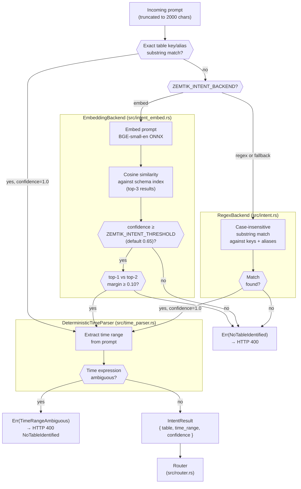

# Intent Engine

**Document type:** Explanation
**Audience:** Developers and security architects evaluating or extending Zemtik
**Goal:** Understand how Zemtik extracts query intent without calling an LLM, what the confidence score means, and when queries fall back to the ZK slow lane

---

## Design principle: no LLM for routing

Zemtik intercepts natural-language queries and must decide whether to route them to FastLane or the ZK SlowLane **before** the query reaches an LLM. Using an LLM for this routing decision would create a circular dependency and — more critically — would transmit the raw query to an external service before any privacy guarantees are established.

The intent engine is therefore entirely local. It extracts two pieces of information from the prompt:

1. **Table key** — which data table the user is asking about
2. **Time range** — the start and end timestamps for the aggregation

If either extraction fails or is ambiguous, the engine routes conservatively to the ZK SlowLane.

---

## Two backends



The intent engine is a Rust trait (`IntentBackend`) with two implementations. Both return an `IntentResult`:

```rust
pub struct IntentResult {
    pub table: String,        // matched table key from schema_config.json
    pub time_range: Option<(u64, u64)>,  // (start_unix, end_unix), None if ambiguous
    pub confidence: f32,      // 0.0–1.0; always 1.0 for RegexBackend
}
```

### `EmbeddingBackend` (default)

Activated by `ZEMTIK_INTENT_BACKEND=embed` (the default when the `embed` feature is compiled in).

**At startup:** Builds a schema index by embedding the following text for each table in `schema_config.json`:

- Table key (e.g. `aws_spend`)
- All `aliases`
- The `description` field
- Each string in `example_prompts`

Each piece is embedded independently using the BGE-small-en model (ONNX, CPU). The resulting vectors form a fixed index in memory.

**At query time:** The incoming prompt is embedded using the same model. The engine computes cosine similarity between the prompt vector and every vector in the schema index, then returns the best-matching table key and its similarity score as `confidence`.

**Routing based on confidence:**

| Condition | Outcome |
|-----------|---------|
| Confidence ≥ `ZEMTIK_INTENT_THRESHOLD` (default 0.65) | Route using matched table's sensitivity |
| Confidence < threshold | Route to ZK SlowLane (fail-secure) |
| No table found | Return `Err(NoTableIdentified)` → HTTP 400 |

The confidence score flows into the `EvidencePack.zemtik_confidence` field and is stored in the receipts database. This gives auditors a machine-readable record of how confident the system was in each routing decision.

### `RegexBackend` (fallback)

Activated by `ZEMTIK_INTENT_BACKEND=regex`, or automatically when the embedding model fails to initialize (e.g., first-run download failure, air-gapped environment).

Uses direct substring and keyword matching against table keys and `aliases` in `schema_config.json`. Matching is case-insensitive.

`RegexBackend` always returns `confidence = 1.0` because it is deterministic — either the keyword is present or it is not. This does not mean the match is more reliable than the embedding backend; it means confidence tracking is not meaningful for this backend.

**When to use:** Air-gapped deployments, environments where the ~130MB model download is not feasible, or as a fast fallback for known table keywords.

---

## Time range extraction (`DeterministicTimeParser`)

Both backends use the same deterministic time parser. It extracts a `(start_unix, end_unix)` pair from the prompt string using pattern matching.

### Supported patterns

| Pattern | Example | Resolves to |
|---------|---------|-------------|
| `Q[1-4] YYYY` | `Q1 2024` | Jan 1–Mar 31 2024, 00:00–23:59 UTC |
| `H[1-2] YYYY` | `H2 2025` | Jul 1–Dec 31 2025 |
| `FY YYYY` | `FY 2024` | Full fiscal year (with offset applied) |
| `MMM YYYY` | `March 2024` | Full calendar month |
| `YYYY` | `2024` | Full calendar year |
| `YTD` / `year to date` | `YTD` | Jan 1 of the current year → today |
| `this quarter` | `this quarter` | Current quarter start → today |
| `last quarter` | `last quarter` | Previous quarter, full |
| `this month` | `this month` | Current calendar month start → today |
| `last month` | `last month` | Previous calendar month, full |
| `past N days` | `past 30 days` | Rolling N-day window ending now |

### Unrecognized time expressions

If the prompt contains a time-like word that does not match any pattern, the parser returns `TimeRangeAmbiguous`.

Expressions that trigger `TimeRangeAmbiguous` include: `recently`, `previously`, `next year`, `current year`, `earlier`, `ago`, `before the acquisition`, `in the old fiscal year`. Relative expressions with clear semantics — `last year`, `prior year`, `last quarter`, `prior quarter`, `last month`, `prior month` — are **recognized** patterns and do not trigger `TimeRangeAmbiguous`.

A `TimeRangeAmbiguous` result causes the proxy to return **HTTP 400** with `code: NoTableIdentified`. The ZK SlowLane is not invoked — the proxy requires a precise time range before it can construct a valid ZK witness, so ambiguous time expressions are rejected rather than routed conservatively.

If no time expression is found at all, `time_range` is `None` and the table-level sensitivity determines routing.

---

## Fallback chain

The complete fallback chain from strongest to most conservative:

```
EmbeddingBackend
  ├── confidence ≥ threshold + unambiguous time  →  route by table sensitivity
  ├── confidence < threshold                     →  Err(NoTableIdentified) → HTTP 400
  ├── low margin (top-2 scores within 0.10)      →  Err(NoTableIdentified) → HTTP 400
  ├── TimeRangeAmbiguous                         →  HTTP 400 (NoTableIdentified)
  ├── NoTableIdentified                          →  HTTP 400
  └── init failure                               →  fall back to RegexBackend

RegexBackend
  ├── table matched + unambiguous time           →  route by table sensitivity
  ├── TimeRangeAmbiguous                         →  HTTP 400 (NoTableIdentified)
  └── NoTableIdentified                          →  HTTP 400
```

> **Note:** Low confidence does **not** route to `ZK SlowLane`. It produces `NoTableIdentified` and the proxy returns HTTP 400. `TimeRangeAmbiguous` also produces HTTP 400, regardless of whether a table was identified during the process — the proxy requires a precise time bound to construct a valid ZK witness. `ZK SlowLane` is only invoked when intent extraction succeeds completely (table identified via `EmbeddingBackend` or `RegexBackend` + time range unambiguous or absent), and the table has `critical` sensitivity or is unknown to `schema_config.json`.


---

## Evaluating accuracy

An evaluation harness ships at `eval/intent_eval.rs`. It runs against a labeled dataset (`eval/labeled_prompts.json`) and reports per-table accuracy, confidence distributions, and routing decisions.

```bash
cargo run --bin intent-eval --features eval
```

The CI pipeline (`release.yml`) runs this eval as a gate before cross-compilation. A failing eval blocks the release.

To add test cases, edit `eval/labeled_prompts.json`:

```json
[
  {
    "prompt": "Cloud costs for Q3 2025",
    "expected_table": "aws_spend",
    "expected_route": "FastLane"
  }
]
```

---

## Extending with a new backend

Implement the `IntentBackend` trait in `src/intent.rs`:

```rust
pub trait IntentBackend: Send + Sync {
    fn index_schema(&mut self, schema: &SchemaConfig);
    fn match_prompt(&self, prompt: &str, k: usize) -> Vec<(String, f32)>;
}
```

- `index_schema` is called once at proxy startup with the loaded `SchemaConfig`. It does not return a `Result`; initialization errors should panic or be handled internally.
- `match_prompt` returns a list of `(table_key, score)` pairs sorted by score descending. `k` is the number of results requested (typically 1). The caller (`extract_intent` in `intent.rs`) applies the threshold and margin checks against the returned scores.
- The `Send + Sync` bounds are required because the backend is stored behind an `Arc<dyn IntentBackend>` shared across async Axum handlers.

Register your backend by adding a new arm to the backend dispatch in `src/intent.rs`.
