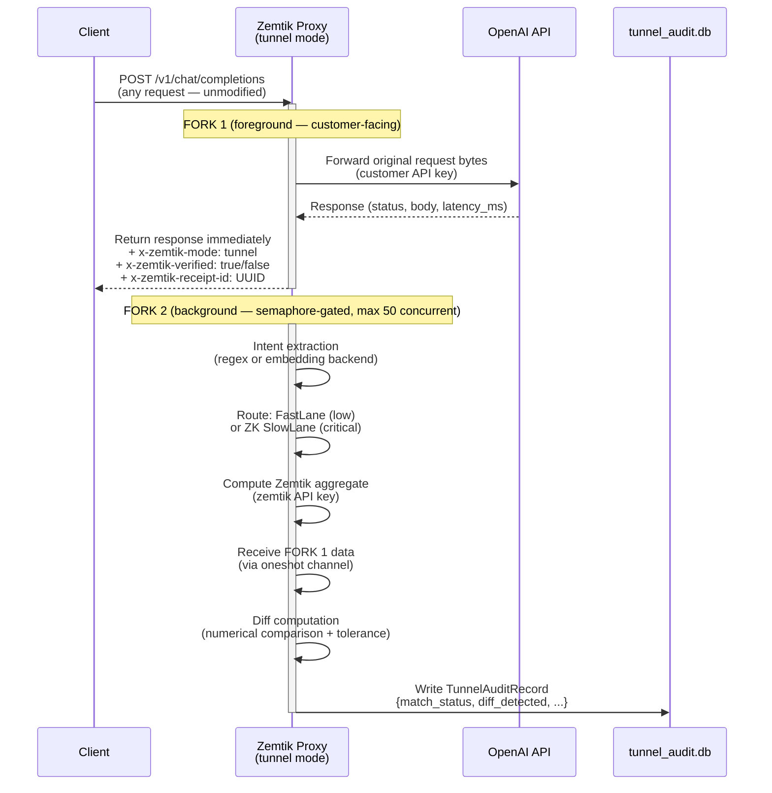

# Tunnel Mode

**Document type:** Feature reference
**Audience:** Engineers evaluating or operating Tunnel Mode
**Version:** v0.9.0+

---

## What is Tunnel Mode?

Tunnel Mode lets a pilot customer route OpenAI traffic through Zemtik without changing anything about their application. Every request is forwarded to OpenAI **untouched and unblocked** (FORK 1) while Zemtik runs its ZK verification pipeline in the background (FORK 2) and logs a comparison audit record.

The goal is frictionless evaluation: the customer sees zero latency penalty and zero risk of broken requests. Zemtik learns how well its verification matches real responses before any enforcement is turned on.

---

## Data flow



**Key invariant:** FORK 1 always returns first. The client never waits for FORK 2.

---

## Configuration

### Environment variables

| Variable | Default | Description |
|----------|---------|-------------|
| `ZEMTIK_MODE` | `standard` | Set to `tunnel` to enable tunnel mode. Other values are rejected at startup. |
| `ZEMTIK_TUNNEL_API_KEY` | — | **Required.** API key forwarded to OpenAI in FORK 1 (and used for FORK 2 verification calls). Proxy refuses to start if unset — verification calls must be billed to zemtik, not the pilot customer. |
| `ZEMTIK_TUNNEL_MODEL` | `gpt-5.4-nano` | Model used by Zemtik's FORK 2 verification pipeline. Should match what the customer sends. |
| `ZEMTIK_TUNNEL_TIMEOUT_SECS` | `180` | Seconds FORK 2 is allowed to run before it is cancelled and `match_status=timeout` is recorded. |
| `ZEMTIK_TUNNEL_SEMAPHORE_PERMITS` | `50` | Max concurrent FORK 2 verifications. Excess requests get `match_status=backpressure` and `x-zemtik-verified: false`. |
| `ZEMTIK_DASHBOARD_API_KEY` | — | If set, `/tunnel/audit`, `/tunnel/audit/csv`, and `/tunnel/summary` require `Authorization: Bearer <key>`. Warning printed at startup if missing. |
| `ZEMTIK_TUNNEL_AUDIT_DB_PATH` | `~/.zemtik/tunnel_audit.db` | Path to the SQLite audit database (WAL mode). |

### `schema_config.json` — per-table tolerance

Add `tunnel_diff_tolerance` to any table to override the default numerical comparison tolerance:

```json
{
  "tables": {
    "aws_spend": {
      "sensitivity": "low",
      "tunnel_diff_tolerance": 0.05
    }
  }
}
```

Default tolerance when not set: `0.01` (1%).

---

## Routes in tunnel mode

| Route | Description |
|-------|-------------|
| `POST /v1/chat/completions` | Main tunnel handler (FORK 1 + FORK 2). Supports streaming and non-streaming. |
| `GET /tunnel/audit` | Paginated JSON audit log with filters. |
| `GET /tunnel/audit/csv` | CSV export of audit log. |
| `GET /tunnel/summary` | Aggregate metrics (match rate, diff rate, avg latency). |
| `GET /health` | Health check with tunnel semaphore fields. |
| `GET /verify/{id}` | Existing proof bundle verification (unchanged). |
| `/{*path}` | Passthrough: all other routes forwarded to OpenAI as-is (no audit logging). |

---

## `match_status` values

| Value | Meaning |
|-------|---------|
| `matched` | FORK 2 completed; diff was within tolerance. |
| `diverged` | FORK 2 completed; diff exceeded tolerance (`diff_detected=true`). Zemtik and OpenAI returned different numbers. |
| `unmatched` | Intent extraction failed or returned no table; Zemtik could not verify this prompt type. No diff computed. |
| `error` | FORK 2 encountered an unexpected error during verification. `error_message` field contains details. |
| `timeout` | FORK 2 exceeded `ZEMTIK_TUNNEL_TIMEOUT_SECS`. |
| `backpressure` | Semaphore was exhausted; FORK 2 was not started. `x-zemtik-verified: false` header set on FORK 1 response. |

---

## `diff_summary` values

| Value | Meaning |
|-------|---------|
| `within_tolerance` | Numbers extracted from both responses differ by ≤ `tunnel_diff_tolerance`. |
| `no_numerical_data` | Neither the OpenAI response nor Zemtik's aggregate contained extractable numbers. |
| `numerical_divergence: X vs Y (Z% diff)` | Numeric values differ by more than tolerance. `diff_detected=true`. |
| `different_count: N vs M numbers` | Both responses have numbers but different counts — can't pair them for comparison. `diff_detected=true`. |
| `text_divergence` | Responses differ in content but neither contains numbers. `diff_detected=true`. |
| `accumulator_overflow` | Streaming response exceeded 1MB; diff computed on partial content. |
| `null` | No diff attempted (e.g., `match_status` is not `matched`). |

---

## `TunnelAuditRecord` fields

| Field | Type | Description |
|-------|------|-------------|
| `id` | string | UUID v4 primary key — correlates with `x-zemtik-receipt-id` response header. |
| `receipt_id` | string? | Optional. Reserved for future correlation with the `receipts` table; always `NULL` for tunnel audit records. |
| `created_at` | string | ISO-8601 UTC timestamp. |
| `match_status` | string | See `match_status` values above. |
| `matched_table` | string? | Table key resolved by intent extraction, e.g. `"aws_spend"`. |
| `matched_agg_fn` | string? | `"sum"`, `"count"`, or `"avg"`. |
| `original_status_code` | integer | HTTP status code returned by OpenAI in FORK 1. |
| `original_response_body_hash` | string | SHA-256 hex of the raw FORK 1 response body. |
| `original_latency_ms` | integer | Time from FORK 1 request send to response body received. |
| `zemtik_aggregate` | integer? | Aggregate computed by FORK 2 (null if `match_status != matched`). |
| `zemtik_row_count` | integer? | Number of rows included in the computation. |
| `zemtik_engine` | string? | `"fast_lane"` or `"zk_slow_lane"`. |
| `zemtik_latency_ms` | integer? | FORK 2 engine execution time in milliseconds. |
| `diff_detected` | boolean | `true` if numerical or textual divergence was found. |
| `diff_summary` | string? | Human-readable diff summary (see table above). |
| `diff_details` | string? | JSON details for `numerical_divergence` cases. |
| `original_response_preview` | string? | First 500 chars of the FORK 1 response body. |
| `zemtik_response_preview` | string? | Zemtik's formatted aggregate string. |
| `error_message` | string? | Error detail when `match_status=error`. |
| `request_hash` | string | SHA-256 hex of the full request body. |
| `prompt_hash` | string | SHA-256 hex of the last user message content. |
| `intent_confidence` | float? | Intent confidence score (0.0–1.0) from intent extraction. |
| `tunnel_model` | string? | OpenAI model used in FORK 2. |

---

## Example audit record (JSON)

```json
{
  "id": "a1b2c3d4-e5f6-7890-abcd-ef1234567890",
  "receipt_id": null,
  "created_at": "2026-04-08T15:01:23Z",
  "match_status": "matched",
  "matched_table": "aws_spend",
  "matched_agg_fn": "sum",
  "original_status_code": 200,
  "original_response_body_hash": "deadbeef...",
  "original_latency_ms": 312,
  "zemtik_aggregate": 48750,
  "zemtik_row_count": 127,
  "zemtik_engine": "fast_lane",
  "zemtik_latency_ms": 43,
  "diff_detected": false,
  "diff_summary": "within_tolerance",
  "diff_details": null,
  "original_response_preview": "The total AWS spend for Q1 2024 was $48,750.",
  "zemtik_response_preview": "48750",
  "error_message": null,
  "request_hash": "c0ffee...",
  "prompt_hash": "babe...",
  "intent_confidence": 0.97,
  "tunnel_model": "gpt-5.4-nano"
}
```

---

## `/tunnel/audit` query parameters

| Parameter | Values | Description |
|-----------|--------|-------------|
| `match_status` | `matched`, `diverged`, `unmatched`, `error`, `timeout`, `backpressure` | Filter by status. |
| `diff_detected` | `true`, `false` | Filter by whether a diff was found. |
| `from` | ISO-8601 datetime | Records created at or after this time. |
| `to` | ISO-8601 datetime | Records created at or before this time. |
| `table` | string | Filter by `matched_table`. |
| `limit` | integer (default 100) | Max records to return. |
| `offset` | integer (default 0) | Skip N records (pagination). |

Response shape:
```json
{ "records": [...], "count": 42 }
```

---

## `/tunnel/summary` response

```json
{
  "total_requests": 1024,
  "matched_rate": 0.87,
  "diff_rate": 0.03,
  "avg_zemtik_latency_ms": 52.4
}
```

- `matched_rate`: fraction of requests where FORK 2 successfully verified.
- `diff_rate`: fraction of all requests (not just matched) where `diff_detected=true`.
- `avg_zemtik_latency_ms`: mean FORK 2 latency across matched records.

---

## `list-tunnel` CLI

```bash
cargo run -- list-tunnel           # last 20 records (default)
cargo run -- list-tunnel --limit 10
```

Output:
```
ID          | Created At          | Status    | Table     | Diff  | Summary
a1b2c3d4    | 2026-04-08 15:01:23 | matched   | aws_spend | false | within_tolerance
e5f67890    | 2026-04-08 15:01:45 | unmatched | -         | false | -
```

---

## Response headers

Every `POST /v1/chat/completions` response in tunnel mode includes:

| Header | Values | Description |
|--------|--------|-------------|
| `x-zemtik-mode` | `tunnel` | Always present in tunnel mode. |
| `x-zemtik-verified` | `true`, `false` | `false` when backpressure prevented FORK 2. |
| `x-zemtik-receipt-id` | UUID | Correlates with the `id` column in the `tunnel_audit` database. |

---

## Startup checklist

1. `ZEMTIK_MODE=tunnel` — required to activate tunnel mode.
2. `ZEMTIK_TUNNEL_API_KEY` — **required**; proxy will not start without it. Use zemtik's own OpenAI key, not the customer's.
3. `ZEMTIK_DASHBOARD_API_KEY` — set to protect `/tunnel/audit` endpoints (warning printed if missing).
4. `schema_config.json` — must contain the tables your customers query.
5. Health check: `curl http://localhost:4000/health` — verify `tunnel_semaphore_available` is present.

See [docs/INTEGRATION_CHECKLIST.md](INTEGRATION_CHECKLIST.md) for the step-by-step pre-demo validation script.
