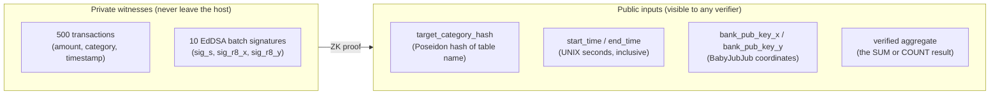
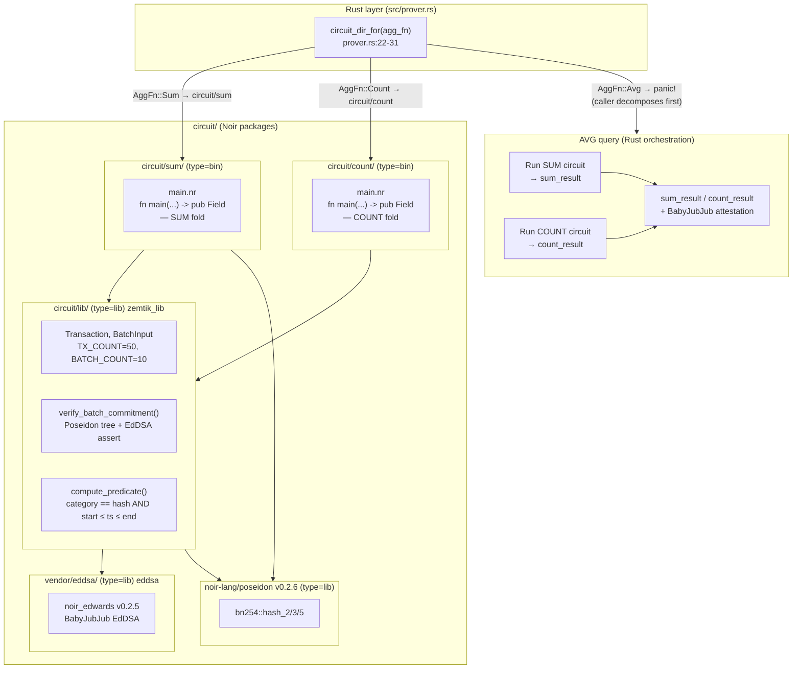
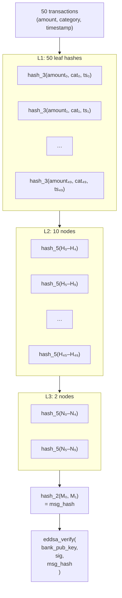
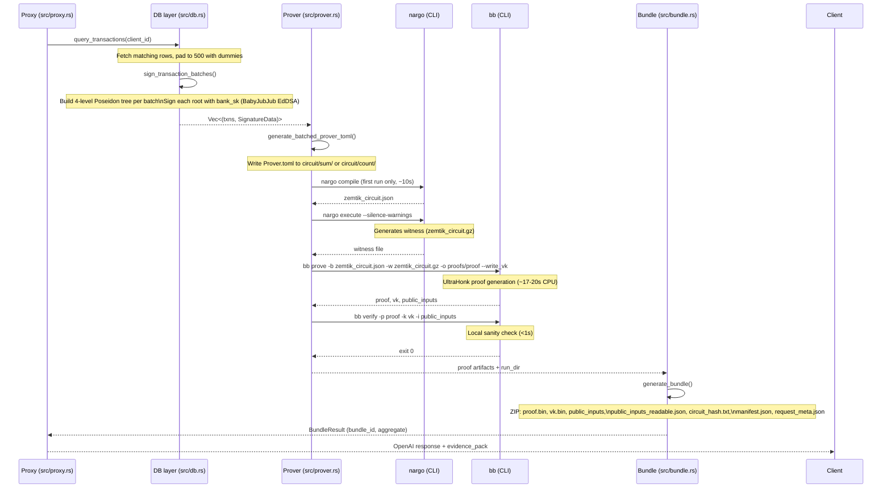
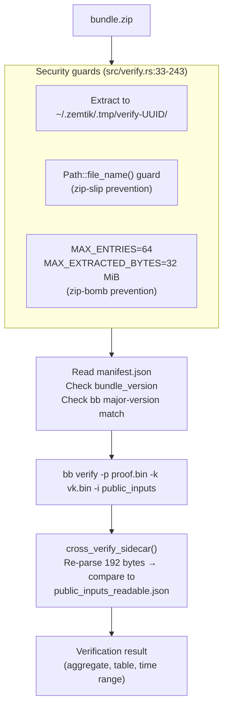
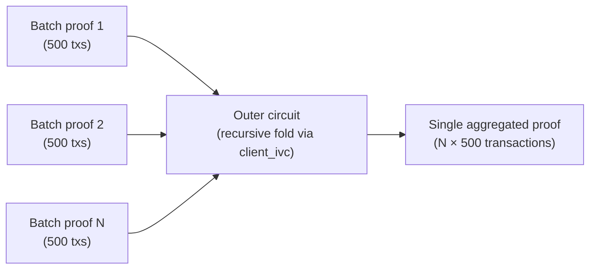

# ZK Circuits Reference

**Document type:** Technical reference  
**Audience:** Layered — security architects (Sections 1–2), integrating developers (Sections 3–7), ZK practitioners (Sections 4, 8)  
**Version:** v0.9.1+

---

## Quick summary

Zemtik's ZK slow lane lets a bank prove — to any auditor, anywhere, without a trusted third party — that it correctly computed an aggregate over its own signed ledger, without revealing any individual transaction. The proof is a short binary blob. Anyone with the bank's public key can verify it in under one second using the open-source `bb` binary from the Barretenberg project.

This document covers what the proof actually proves, how Zemtik's Noir circuits are structured, what the current constraints are, and where the architecture goes next.

---

## Section 1: What the ZK slow lane proves

### The claim

> The bank computed the correct **SUM** (or **COUNT**) of all transactions in its signed ledger matching category `X` between timestamps `start` and `end`, and no individual transaction was revealed in the process.

This is not just a hash check or a signature over a pre-computed result. The proof cryptographically binds three things together in a single statement:

1. These specific transactions were **signed by the bank's KMS key**.
2. The transactions that match the filter are **exactly those included** in the aggregate.
3. The aggregate **equals the claimed output**.

If any of the three is false, proof generation fails — not silently, but with a constraint violation that prevents a valid proof from being produced at all.

### What is private vs. public



The only information that crosses the boundary is the proof itself and the six public inputs listed above. Raw transaction amounts, individual timestamps, and per-row categories never appear in any network request or log.

### Trust model

The **bank's BabyJubJub signing key** (`~/.zemtik/keys/bank_sk`) is the root of trust. The bank generates this key at startup and uses it to sign every batch of 50 transactions before passing them to the circuit.

If you trust the bank's public key, you trust the proof. Verification is:

```bash
cargo run -- verify <bundle.zip>
# or directly:
bb verify -p proof.bin -k vk.bin -i public_inputs
```

### Threat model (what the proof does and does not protect)

| Threat | Protected? | Notes |
|--------|-----------|-------|
| Forging the bank's signature on transactions | No (proof fails) | Requires the bank's private key |
| Lying about the aggregate (wrong SUM/COUNT) | No (proof fails) | Circuit enforces the fold exactly |
| Seeing individual transaction amounts over the network | No | Private witnesses are not included in any network request or HTTP response |
| Replaying an old proof for a different time range | No | `start_time` and `end_time` are public inputs; range is bound into the proof |
| Learning upper bound on row count | Partial | Padding is fixed at 500. Verifier can infer at most 500 rows matched. |
| Tampered `public_inputs_readable.json` sidecar | Partial | Sidecar hash is in `manifest.json`, but the sidecar is not a circuit public input — known limitation, tracked. |
| Submitting a proof for data the bank did not sign | No | EdDSA verification runs inside the circuit |

---

## Section 2: ZK primer (intuition only)

### What a ZK proof is

A ZK proof is a **receipt**. It says: "I ran program P on some hidden inputs, and the output was Y." The verifier checks the receipt in milliseconds and becomes convinced that P ran correctly on *some* valid hidden inputs — without learning what those inputs were.

In Zemtik's case, P is the sum/count circuit, the hidden inputs are the raw transactions and signatures, and Y is the aggregate.

### Public vs. private inputs

Every ZK circuit has two kinds of inputs:

- **Public inputs** — declared with `pub` in Noir. Known to both the prover (bank) and verifier (auditor). Bound into the proof.
- **Private inputs (witnesses)** — everything else. Used during proof generation. Never revealed.

### Commitment schemes

A commitment scheme lets you "lock in" a value now and open it later. In Zemtik, the bank commits to each batch of 50 transactions using a Poseidon hash tree. The circuit verifies the commitment and the bank's EdDSA signature over it — inside the proof. This means the verifier is guaranteed that the transactions the bank used in the fold are the same ones the bank signed, without ever seeing them.

**Why Poseidon?** Most cryptographic hash functions (SHA-256, Keccak) require thousands of arithmetic constraints per evaluation inside a ZK circuit. Poseidon was designed specifically for this setting and needs roughly 100-200 constraints for the same security level. This is why Zemtik's 4-level commitment tree is practical at 50 transactions per batch.

### Digital signatures inside the circuit

EdDSA (BabyJubJub) signature verification runs *inside* the Noir circuit — not as a pre-check in Rust. This matters: if the signature check were outside, a malicious prover could use unsigned data for the fold and valid signed data only for the pre-check. Running `eddsa_verify` inside the circuit binds "these transactions were signed by the bank KMS" to "this aggregate is the correct fold over exactly these transactions" in a single atomic constraint.

### Noir

Noir is a Rust-like domain-specific language that compiles to ACIR (Abstract Circuit Intermediate Representation). You declare the computation with normal Rust-style code, annotate public inputs with `pub`, and the compiler translates the whole thing into arithmetic constraints over a finite field. `nargo` is the Noir compiler and witness generator.

### UltraHonk

UltraHonk is the proving backend that Barretenberg (`bb`) implements. It produces a compact proof from a set of ACIR constraints. Key properties for Zemtik:

- **CPU-only** — no GPU required.
- **No per-circuit trusted setup** — the same universal SRS is used for any circuit.
- **Short proofs** — verification is fast regardless of circuit size.
- **`bb prove`** generates the proof; **`bb verify`** checks it. Both are called as subprocesses from `src/prover.rs`.

---

## Section 3: Zemtik's circuit layout

### Mini-circuit split

Zemtik uses three Noir packages rather than one monolithic circuit:



**Why three packages instead of one:**

- A monolithic circuit with all aggregation logic would increase gate count proportionally even for queries that only need SUM. Each mini-circuit compiles to its own ACIR binary with exactly the gates it needs.
- `lib` is a Noir `type = "lib"` package — it never compiles to a standalone proof. It is a shared dependency linked into `sum` and `count` at compile time.
- Both `sum` and `count` have `package.name = "zemtik_circuit"` in their `Nargo.toml`. The Rust prover selects which subdirectory to `nargo compile` based on `circuit_dir_for(agg_fn, base)`.
- AVG has no circuit of its own. `circuit_dir_for` panics if called with `AggFn::Avg`. The caller (`src/proxy.rs`) decomposes AVG into two sequential proofs (SUM then COUNT) before invoking the prover.

### Shared types (`circuit/lib/src/lib.nr`)

```noir
pub global TX_COUNT: u32 = 50;     // transactions per batch
pub global BATCH_COUNT: u32 = 10;  // batches per proof (500 total)

pub struct Transaction {
    pub amount: u64,
    pub category: Field,    // Poseidon hash of category name
    pub timestamp: u64,
}

pub struct BatchInput {
    pub transactions: [Transaction; TX_COUNT],
    pub sig_s:    Field,
    pub sig_r8_x: Field,
    pub sig_r8_y: Field,
}
```

These constants are fixed at circuit compile time. ACIR loops require compile-time-known bounds — you cannot write `for i in 0..n` where `n` is a runtime value. The 500-transaction ceiling is therefore a hard architectural constraint of the current circuit, not a configurable parameter.

### The 4-level Poseidon Merkle commitment

For each batch of 50 transactions, the circuit builds a Poseidon hash tree and verifies an EdDSA signature over the root:



Source: `circuit/lib/src/lib.nr`, function `verify_batch_commitment` (lines 40–82).

The EdDSA `assert` at the bottom is the critical constraint: if it fails (invalid signature), the entire proof generation aborts with a constraint violation. The Rust side (`src/db.rs`, function `sign_transaction_batches`) produces the signatures that satisfy this assert.

### The predicate

After the commitment check, each transaction is tested against the query filter (`compute_predicate`, `lib.nr` lines 86–99):

```noir
matches[i] = (batch.transactions[i].category == target_category_hash)
           & (batch.transactions[i].timestamp >= start_time)
           & (batch.transactions[i].timestamp <= end_time);
```

Both conditions must hold simultaneously. Dummy sentinel transactions (`__zemtik_dummy__`) have a category field whose Poseidon hash never equals any real `target_category_hash`, so they contribute 0 to the aggregate naturally.

### SUM vs COUNT: the only difference

| Circuit | File | Fold line |
|---------|------|-----------|
| SUM | `circuit/sum/src/main.nr:18` | `total += if matches[i] { batch.transactions[i].amount as Field } else { 0 }` |
| COUNT | `circuit/count/src/main.nr:20` | `total += if matches[i] { 1 } else { 0 }` |

Everything else — the `main` signature, the `BatchInput` loop, the commitment verification — is identical. Both circuits return a single `pub Field` (the aggregate).

### Public inputs (both circuits, identical ABI)

```noir
fn main(
    target_category_hash: pub Field,
    start_time:           pub u64,
    end_time:             pub u64,
    bank_pub_key_x:       pub Field,
    bank_pub_key_y:       pub Field,
    batches:              [BatchInput; BATCH_COUNT],  // private
) -> pub Field  // the aggregate
```

The six public values are serialized into the 192-byte `public_inputs` file in the proof bundle: `[target_category_hash, start_time, end_time, bank_pub_key_x, bank_pub_key_y, verified_aggregate]`, each as a 32-byte big-endian field element.

---

## Section 4: Why the EdDSA library is vendored

The `vendor/eddsa/` directory (`Nargo.toml` pinned to `noir_edwards = "v0.2.5"`) replaces the upstream Noir `ec` library for BabyJubJub operations.

The upstream `ec` library is generic across elliptic curves. That generality costs ~1.7 million gates just for one EdDSA verification when instantiated over BabyJubJub. `noir_edwards` is specialized to BabyJubJub's curve parameters, reducing the gate count significantly.

**Gate count with vendored library: 728,283 constraints** for the full SUM circuit (50 × 10 = 500 transactions, 10 EdDSA verifications, full Poseidon tree, predicate fold). This translates to:

- ~17–20 seconds for `bb prove` on a modern CPU (single-threaded)
- ~1 second for `bb verify`
- ~10 seconds for `nargo compile` on first run (cached after)

Without the optimization, proof time would exceed 60 seconds on the same hardware.

---

## Section 5: Developer constraints

### Hard 500-transaction cap

`src/db.rs:149`:
```rust
pub const MAX_ZK_TX_COUNT: usize = BATCH_SIZE * 10; // 50 × 10 = 500
```

If a query matches more than 500 rows, the slow lane returns a hard error:

```
Too many matching rows (N=623); ZK SlowLane supports up to 500 transactions per query.
Narrow the time range or set sensitivity to 'low' to use FastLane instead.
```

This is not a truncation — the circuit requires exactly 500 transaction slots (fixed ACIR loop bounds). Partial results would silently produce a wrong aggregate.

**Design around it:** Use time-scoped queries (quarterly, monthly). If you genuinely need aggregates over thousands of rows, wait for the recursive-proof architecture (Section 9) or use FastLane for low-sensitivity tables.

### Sentinel padding

When fewer than 500 transactions match, the Rust layer pads with dummy rows:

```rust
// src/db.rs:154
pub const DUMMY_CATEGORY: &str = "__zemtik_dummy__";

// Padding (src/db.rs:187–199)
txns.push(Transaction {
    amount: 0,
    category_name: DUMMY_CATEGORY.to_owned(),
    timestamp: 0,
    ..
});
```

Dummy rows are excluded by the circuit predicate: their `category` field is `poseidon_of_string("__zemtik_dummy__")`, which never equals any real `target_category_hash` because real table keys pass the canonicalization rules below (no `__` prefix, all lowercase ASCII).

The padding is transparent to the verifier. An auditor checking the proof cannot distinguish "500 real matches" from "300 real matches + 200 dummies" — both produce a valid proof with the correct aggregate.

### Category hash canonicalization

`poseidon_of_string` (`src/db.rs:25–84`) converts a table key string to the `Field` element that both the Rust signing code and the Noir circuit use as `target_category_hash`. Mismatches between the two produce constraint failures (proof generation error).

The rules:

1. **Trim whitespace** from both ends.
2. **Lowercase** (`to_ascii_lowercase()`).
3. **Reject non-ASCII** bytes (hard error).
4. **Reject empty** string (hard error).
5. **Max 93 bytes** after canonicalization (3 × 31-byte chunks; hard error above this).
6. **Chunk encoding**: split into three 31-byte groups, each zero-padded on the left to 31 bytes, then placed as the low 31 bytes of a 32-byte big-endian field element.
7. **Hash**: `bn254::hash_3([chunk0, chunk1, chunk2])`.

This is verified against the Noir circuit in the test `test_poseidon_aws_spend` (`circuit/sum/src/main.nr:61–69`): both sides must produce the same field element for `"aws_spend"`.

**Gotcha:** If your table key in `schema_config.json` contains uppercase letters, spaces, or non-ASCII bytes, `poseidon_of_string` will reject it at startup or produce a hash that does not match what you expect. Keep table keys lowercase ASCII, no spaces, no special characters except underscores.

### Timestamp units

The circuit treats `start_time` and `end_time` as **UNIX seconds** (`u64`). If your Postgres table stores epoch-milliseconds, all rows will fall outside the filter range and the aggregate will be 0 with no error. Verify your timestamp column unit before integrating. The `DeterministicTimeParser` in `src/time_parser.rs` always produces seconds.

### Zero-result queries

If no transactions match the filter (empty time range, wrong category key, or 0 rows in the table), the circuit produces an aggregate of 0. This is not an error — the proof is valid and verifies correctly. A zero result from a SUM query is indistinguishable from a misconfiguration at the circuit level. If `count_result = 0` and you attempt AVG, the Rust division `sum / count` will panic. Verify COUNT > 0 before running AVG on a potentially empty dataset.

### Concurrent ZK proofs

Each proof writes to `circuit/<sum|count>/Prover.toml` and reads/writes `~/.zemtik/runs/<uuid>/`. The `Prover.toml` path is shared per circuit subdirectory. Two concurrent slow-lane requests for the same aggregation type will race on `Prover.toml`, corrupting the input for one of them. The proxy does not currently serialize ZK slow-lane requests. Do not send concurrent critical-sensitivity queries in production until this is addressed.

### Prover.toml contains raw data on disk

`src/prover.rs:34–72` writes all transaction amounts, category hashes, and timestamps to `circuit/<sum|count>/Prover.toml` before calling `nargo execute`. This file persists on disk at `~/.zemtik/circuit/`. Raw transaction data does not leave the host machine, but it is written in plaintext on disk for the duration of proof generation. Ensure disk encryption is enabled on the host running the proxy if transaction confidentiality at-rest matters.

### Adding a new table

No circuit changes are required. The circuit uses `target_category_hash` as a public input — the same compiled binary handles any table key. To add a new table to the ZK slow lane:

1. Add the table to `schema_config.json` with `"sensitivity": "critical"`. The entry also requires `description` and `example_prompts` fields for the embedding intent backend:

```json
"payroll": {
  "sensitivity": "critical",
  "physical_table": "payroll",
  "description": "Employee payroll data including salaries and bonuses",
  "example_prompts": ["total payroll for Q1 2025", "payroll spend last quarter"]
}
```

2. Ensure the `physical_table` column exists in your Postgres schema.
3. Start the proxy. Intent extraction will route matching queries to the slow lane.

### AVG is two proofs

AVG decomposes to:
1. Run the SUM circuit → get `sum_result`.
2. Run the COUNT circuit → get `count_result`.
3. In Rust: `avg = sum_result / count_result`.
4. Produce a BabyJubJub attestation over the division result.

There is no single AVG circuit. This doubles proof time for AVG queries.

### Prover.toml generation

`src/prover.rs:34–72` serializes the batched inputs to `circuit/<sum|count>/Prover.toml`. Circuit dispatch (`circuit_dir_for`, `src/prover.rs:22–31`) selects the subdirectory: SUM → `circuit/sum`, COUNT → `circuit/count`. Calling `circuit_dir_for` with `AggFn::Avg` panics — the caller must decompose AVG before calling the prover.

---

## Section 6: End-to-end slow lane flow



**Artifact locations on disk:**

```
~/.zemtik/runs/<uuid>/
  Prover.toml
  target/zemtik_circuit.json   ← ACIR
  target/zemtik_circuit.gz     ← witness
  proofs/proof/proof           ← proof bytes
  proofs/proof/vk              ← verification key
  proofs/proof/public_inputs   ← 192-byte serialized public inputs

~/.zemtik/receipts/<uuid>.zip  ← portable bundle
```

---

## Section 7: Offline verification bundle

### Bundle contents

Every ZK slow lane proof produces a portable ZIP bundle (`cargo run -- verify <bundle.zip>`):

| Entry | Description |
|-------|-------------|
| `proof.bin` | UltraHonk proof bytes |
| `vk.bin` | Verification key |
| `public_inputs` | 192 bytes = 6 × 32-byte BE field elements |
| `public_inputs_readable.json` | Human-readable sidecar (category name, dates, aggregate) |
| `circuit_hash.txt` | SHA-256 of `zemtik_circuit.json` |
| `manifest.json` | `bundle_version: 2`, `sidecar_hash`, `zemtik_version` |
| `request_meta.json` | `bundle_id`, `request_hash`, `prompt_hash`, `bb_version` |

### `public_inputs` byte layout

192 bytes, 6 consecutive 32-byte big-endian field elements in order:

```
[0:32]   target_category_hash
[32:64]  start_time
[64:96]  end_time
[96:128] bank_pub_key_x
[128:160] bank_pub_key_y
[160:192] verified_aggregate (SUM or COUNT result)
```

### Verifier flow



`cross_verify_sidecar` (`src/verify.rs:369–454`) re-parses the 192-byte binary `public_inputs` and compares each field to the values in `public_inputs_readable.json`. If they disagree, the bundle is rejected even if `bb verify` passed — the sidecar may have been tampered with.

**Known limitation:** `public_inputs_readable.json` is hashed in `manifest.json` (`sidecar_hash`) but the sidecar values are not themselves circuit public inputs. An attacker who modifies both the sidecar and the manifest hash can produce a bundle that passes `bb verify` but reports incorrect human-readable metadata. The binary `public_inputs` remain authoritative; the sidecar is informational only. This is tracked as a known limitation.

---

## Section 8: Threat model deep-dive

### What Zemtik does not solve

**Transaction provenance at ingestion.** If the bank loads fraudulent transactions into its ledger before signing, the proof verifies — it proves the aggregate over *whatever was signed*, not over "true" real-world transactions. Zemtik solves "did the aggregate match the signed ledger?" not "is the ledger accurate?"

**KMS key compromise.** If an attacker obtains the bank's `bank_sk`, they can sign arbitrary transactions and produce valid proofs. The signing key is stored at `~/.zemtik/keys/bank_sk` (mode 0600) as a plaintext file. There is no HSM or hardware-backed KMS integration in the current release. Treat this file as a high-value secret: restrict OS-level access, use full-disk encryption on the host, and rotate the key if the host is compromised.

**`client_id` is not bound into the proof.** The circuit's public inputs are `target_category_hash`, `start_time`, `end_time`, `bank_pub_key_x`, `bank_pub_key_y`. There is no `client_id` field. A proof generated for one client's data could be presented as if it were for a different client's data — nothing in the circuit prevents this. The `receipts.db` links proofs to client IDs at the application layer, but the proof itself carries no client binding. Be aware of this when designing multi-tenant deployments.

**Denial-of-proof service.** `bb prove` runs single-threaded for approximately 17–20 seconds per request. There is no semaphore or rate limit on ZK slow-lane requests in the current proxy. An adversary flooding `/v1/chat/completions` with `critical`-sensitivity queries can exhaust CPU and starve legitimate requests. Apply rate limiting at the network layer (reverse proxy, API gateway) before exposing the proxy to untrusted callers.

**Prover.toml on disk.** Raw transaction amounts, category hashes, and timestamps are written to `~/.zemtik/circuit/<sum|count>/Prover.toml` during proof generation and not automatically deleted afterward. This does not leave the host, but it is plaintext at rest. Enable full-disk encryption on the proving host.

### Sidecar is not a circuit commitment

`public_inputs_readable.json` is a convenience file for auditors. It is tamper-evident via `manifest.json`'s `sidecar_hash`, but its contents are not inputs to the ZK circuit. Only the 192-byte binary `public_inputs` are what `bb verify` checks. When in doubt, decode the binary directly:

```bash
# Read the 6 field elements from a bundle
python3 -c "
import struct, sys
data = open('public_inputs', 'rb').read()
for i in range(6):
    val = int.from_bytes(data[i*32:(i+1)*32], 'big')
    print(f'Field {i}: {val}')
"
```

### Row count leakage

Padding is always to exactly 500 dummy rows. A verifier observing multiple proofs for the same table over the same time range learns only that each proof covers at most 500 matching rows. The actual count is not revealed.

If the COUNT circuit is used (rather than SUM), the public output is the count itself — which is fully revealed as the return value.

### Category hash collisions

The `poseidon_of_string` encoding uses 3 × 31 bytes = 93 bytes maximum. Two different canonical strings could theoretically collide in the BN254 field. In practice, the BN254 Poseidon collision resistance is ~128 bits. This is not a meaningful risk for the expected number of distinct table names in a production deployment.

---

## Section 9: Future architecture

The current design is production-capable for datasets up to 500 matching rows per query. The path to arbitrary-scale ZK aggregation is recursive proof composition.

### Recursive folding (blocked)

The target architecture uses `bb prove -s client_ivc` to fold multiple batch proofs into a single outer proof:



This would remove the 500-row cap entirely. Instead of running one circuit over 500 transactions, you run N circuits in parallel and then fold the N proofs into one outer proof that the verifier checks in constant time.

**Current blocker:** Barretenberg's `client_ivc` API changed between the nightly builds used in Zemtik's CI and the versions that expose recursive verification without a trusted setup. The feature is tracked in `docs/SCALING.md`. Progress is gated on upstream Barretenberg stabilizing the IVC interface.

**What changes when this lands:** The `MAX_ZK_TX_COUNT` constant becomes a per-batch parameter rather than a total cap. The `query_transactions` function stops padding to 500 and instead partitions the result set into batches. Bundle format will need a `bundle_version: 3` increment to carry the recursive proof structure. Circuit dispatch in `src/prover.rs` will add a new IVC path.

See `docs/SCALING.md` for the full roadmap, parallel-proof sketches, and the `bb prove -s client_ivc` blocking issue details.

---

## Appendix: Key files

| File | What to read |
|------|-------------|
| `circuit/lib/src/lib.nr` | `TX_COUNT`, `BATCH_COUNT`, `verify_batch_commitment`, `compute_predicate` |
| `circuit/sum/src/main.nr` | SUM `main` signature, `process_batch` fold body, `test_poseidon_aws_spend` |
| `circuit/count/src/main.nr` | COUNT `process_batch` — the one-line difference from SUM |
| `vendor/eddsa/Nargo.toml` | `noir_edwards = "v0.2.5"` pin, why this library |
| `src/db.rs:25–84` | `poseidon_of_string` — the canonicalization rules |
| `src/db.rs:147–205` | `MAX_ZK_TX_COUNT`, `DUMMY_CATEGORY`, `query_transactions` padding logic |
| `src/prover.rs:22–72` | `circuit_dir_for`, `generate_batched_prover_toml` |
| `src/prover.rs:147–360` | ABI guard, `compile_circuit`, `execute_circuit`, `generate_proof`, `verify_proof` |
| `src/bundle.rs:64–140` | `generate_bundle` — what goes into each ZIP entry |
| `src/verify.rs:33–454` | `verify_bundle` guards, `cross_verify_sidecar` |
| `docs/SCALING.md` | Recursive proof roadmap, `client_ivc` blocking issue |
